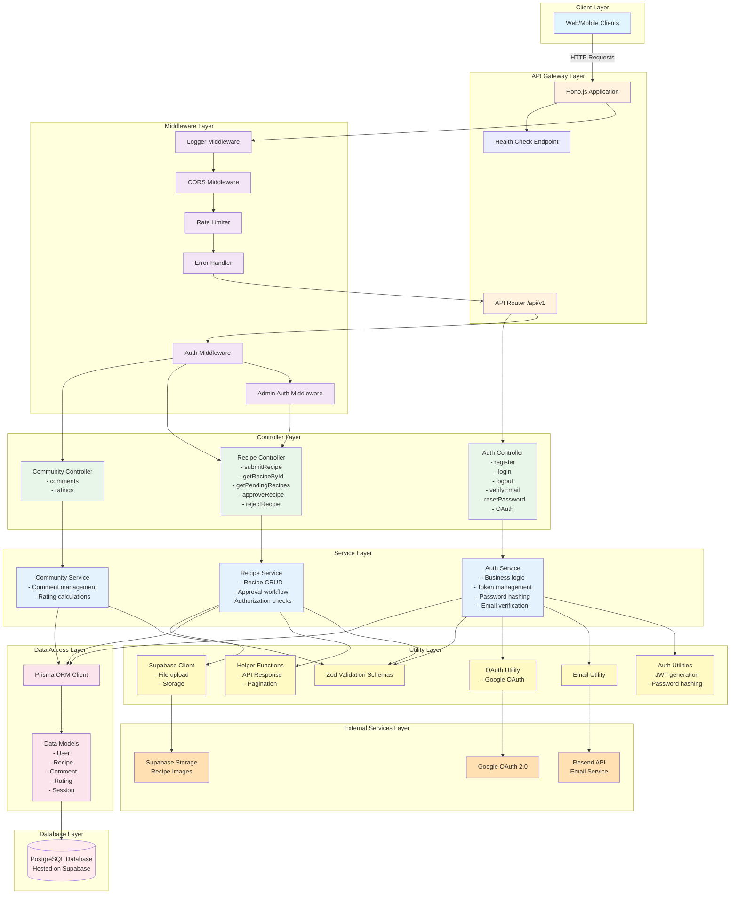
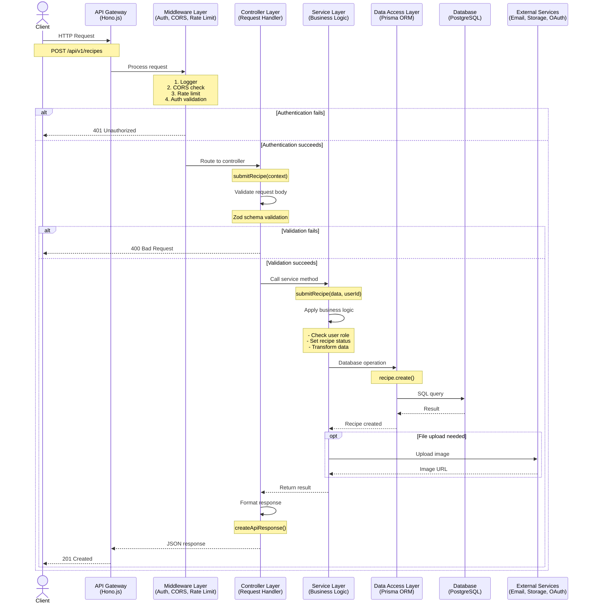
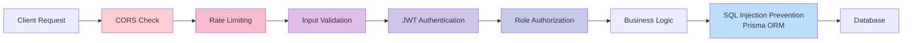
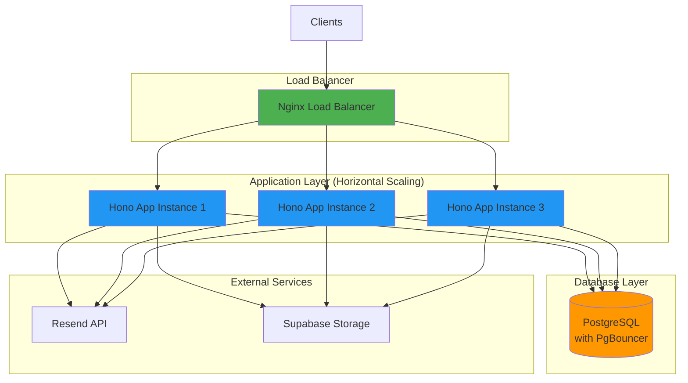

# FitRecipes Backend - Architectural Layer Diagram

This document contains architectural diagrams showing the layered architecture of the FitRecipes Backend API.

---

## Architecture Overview

The FitRecipes Backend follows a **layered architecture** pattern with clear separation of concerns:

1. **API Gateway Layer** - HTTP request handling, routing
2. **Middleware Layer** - Cross-cutting concerns (auth, CORS, rate limiting, error handling)
3. **Controller Layer** - Request validation, response formatting
4. **Service Layer** - Business logic, orchestration
5. **Data Access Layer** - Database operations (Prisma ORM)
6. **External Services Layer** - Third-party integrations (Email, Storage, OAuth)
7. **Database Layer** - PostgreSQL (hosted on Supabase)

---

## 1. Layered Architecture Diagram (Mermaid)



---

## 2. Request Flow Diagram (Mermaid)

Shows how a typical API request flows through the layers:



---

## 3. Layer Responsibilities

### 🌐 API Gateway Layer
**Technology**: Hono.js framework  
**Responsibilities**:
- HTTP request/response handling
- Routing (`/api/v1/*`)
- API versioning
- Health check endpoint

**Files**:
- `src/index.ts` - Main application entry

---

### 🛡️ Middleware Layer
**Responsibilities**:
- **Logger**: Request/response logging
- **CORS**: Cross-origin resource sharing configuration
- **Rate Limiting**: 100 requests per 15 minutes per IP
- **Authentication**: JWT token validation
- **Authorization**: Role-based access control (USER/CHEF/ADMIN)
- **Error Handling**: Global error catching and formatting

**Files**:
- `src/middlewares/auth.ts` - Authentication & authorization
- `src/middlewares/rateLimit.ts` - Rate limiting logic
- `src/middlewares/common.ts` - Error & not found handlers

**Execution Order**:
1. Logger → 2. CORS → 3. Rate Limit → 4. Error Handler → 5. Auth → 6. Admin Auth

---

### 🎮 Controller Layer
**Responsibilities**:
- Request parameter extraction
- Input validation (Zod schemas)
- Calling appropriate service methods
- Response formatting (success/error)
- HTTP status code management

**Files**:
- `src/controllers/authController.ts` - Auth endpoints
- `src/controllers/recipeController.ts` - Recipe endpoints

**Example Controllers**:
- `register()`, `login()`, `logout()`, `verifyEmail()`, `resetPassword()`
- `submitRecipe()`, `getRecipeById()`, `approveRecipe()`, `rejectRecipe()`

---

### 💼 Service Layer
**Responsibilities**:
- **Business Logic**: Core application rules
- **Orchestration**: Coordinating multiple operations
- **Data Transformation**: Converting between formats
- **Authorization Checks**: Who can access what
- **External Service Integration**: Calling email, storage, OAuth

**Files**:
- `src/services/authService.ts` - Authentication business logic
- `src/services/recipeService.ts` - Recipe business logic

**Key Services**:
- **AuthService**: User registration, login, token generation, email verification, password reset, OAuth
- **RecipeService**: Recipe CRUD, approval workflow, authorization checks, image handling

---

### 🗄️ Data Access Layer
**Technology**: Prisma ORM  
**Responsibilities**:
- Database query generation
- Type-safe database operations
- Migration management
- Connection pooling

**Files**:
- `src/utils/database.ts` - Prisma client singleton
- `prisma/schema.prisma` - Database schema definition

**Data Models**:
- User, Recipe, Comment, Rating, Session

---

### 🔧 Utility Layer
**Responsibilities**:
- **Validation**: Zod schemas for all inputs
- **Helpers**: Common functions (API responses, pagination)
- **Auth Utils**: JWT generation, password hashing (bcrypt)
- **Email**: Email sending via Resend API
- **Supabase**: File upload/download to Supabase Storage
- **OAuth**: Google OAuth 2.0 integration

**Files**:
- `src/utils/validation.ts` - Zod schemas
- `src/utils/helpers.ts` - Common helpers
- `src/utils/auth.ts` - JWT & password utilities
- `src/utils/email.ts` - Email service
- `src/utils/supabase.ts` - Supabase Storage client
- `src/utils/oauth.ts` - OAuth providers

---

### 🌍 External Services Layer
**Integrations**:
1. **Resend API** - Transactional emails
   - Password reset emails
   - Email verification
   - Welcome emails

2. **Supabase Storage** - File storage
   - Recipe images
   - User avatars
   - Public URL generation

3. **Google OAuth 2.0** - Social authentication
   - Authorization code flow
   - Account linking
   - Profile data retrieval

---

### 💾 Database Layer
**Technology**: PostgreSQL (hosted on Supabase)  
**Features**:
- **Connection Pooling**: PgBouncer for scalability
- **Transactions**: ACID compliance
- **Indexing**: Optimized queries
- **Migrations**: Version-controlled schema changes

**Schema Highlights**:
- **User**: Authentication, roles, email verification, OAuth
- **Recipe**: Status workflow (PENDING → APPROVED/REJECTED), meal types, dietary info, nutrition info, allergies
- **Comment**: User-generated content on recipes
- **Rating**: 1-5 star ratings with one per user per recipe
- **Session**: JWT session management with expiration

---

## 4. Technology Stack

### Backend Framework
- **Hono.js** - Fast, lightweight web framework for edge runtimes
- **TypeScript** - Type-safe development
- **Bun** - JavaScript runtime (faster than Node.js)

### Database & ORM
- **PostgreSQL** - Relational database
- **Prisma** - Type-safe ORM with migration support
- **Supabase** - Database hosting + storage

### Authentication & Security
- **JWT** - Token-based authentication
- **bcrypt** - Password hashing (10 rounds)
- **Google OAuth 2.0** - Social login
- **Rate Limiting** - DDoS protection

### External Services
- **Resend** - Email delivery
- **Supabase Storage** - File storage

### Testing & Quality
- **Vitest** - Unit & integration testing (59 tests)
- **ESLint** - Code linting
- **Prettier** - Code formatting

### DevOps
- **Docker** - Containerization with multi-stage builds
- **GitHub Actions** - CI/CD pipeline
- **Render** - Production hosting
- **Nginx** - Load balancing (Docker Compose)

---

## 5. Data Flow Examples

### Example 1: User Registration
```
Client → API Gateway → Middleware (CORS, Rate Limit) 
→ Controller (validate input) → Service (hash password, create user, generate token) 
→ Prisma → PostgreSQL
→ Email Utility → Resend API (send verification email)
→ Service → Controller (format response) → Client
```

### Example 2: Recipe Submission (Chef)
```
Client → API Gateway → Middleware (Auth, Role Check) 
→ Controller (validate recipe data) → Service (set status=PENDING) 
→ Prisma → PostgreSQL
→ Supabase Utility → Supabase Storage (upload image)
→ Service → Controller → Client
```

### Example 3: Recipe Approval (Admin)
```
Client → API Gateway → Middleware (Auth, Admin Only) 
→ Controller (validate recipe ID) → Service (check status, update to APPROVED) 
→ Prisma → PostgreSQL
→ Service → Controller → Client
```

---

## 6. Security Layers



**Security Measures**:
1. **CORS** - Whitelist allowed origins
2. **Rate Limiting** - 100 req/15min per IP
3. **Input Validation** - Zod schemas on all inputs
4. **JWT Authentication** - Secure token verification
5. **Role-Based Access** - USER/CHEF/ADMIN permissions
6. **SQL Injection Prevention** - Prisma parameterized queries
7. **Password Hashing** - bcrypt with 10 rounds
8. **Session Management** - Database-stored sessions with expiration

---

## 7. Scalability Architecture



**Scaling Strategy**:
- **3 Application Replicas** via Docker Compose
- **Nginx Load Balancer** for request distribution
- **Stateless Application** - sessions stored in database
- **Connection Pooling** - PgBouncer for efficient database connections
- **Future**: Kubernetes migration for auto-scaling

---

## 8. File Structure Map

```
src/
├── index.ts                    # API Gateway - Entry point
├── config/
│   └── index.ts               # Configuration management
├── routes/                     # API Gateway - Route definitions
│   ├── auth.ts                # /api/v1/auth/*
│   ├── recipe.ts              # /api/v1/recipes/*
│   ├── admin.ts               # /api/v1/admin/*
│   └── community.ts           # /api/v1/community/*
├── middlewares/               # Middleware Layer
│   ├── auth.ts                # JWT auth & role checks
│   ├── rateLimit.ts           # Rate limiting
│   └── common.ts              # Error handling
├── controllers/               # Controller Layer
│   ├── authController.ts      # Auth request handlers
│   └── recipeController.ts    # Recipe request handlers
├── services/                  # Service Layer
│   ├── authService.ts         # Auth business logic
│   └── recipeService.ts       # Recipe business logic
├── utils/                     # Utility Layer
│   ├── database.ts            # Prisma client
│   ├── validation.ts          # Zod schemas
│   ├── helpers.ts             # Common helpers
│   ├── auth.ts                # JWT & bcrypt utils
│   ├── email.ts               # Email service
│   ├── supabase.ts            # Supabase client
│   └── oauth.ts               # OAuth providers
└── types/                     # TypeScript types
    └── index.ts               # Shared type definitions

prisma/
├── schema.prisma              # Database schema
└── migrations/                # Version-controlled migrations

tests/
├── services/                  # Service layer tests
├── controllers/               # Controller tests
├── utils/                     # Utility tests
└── integration/               # End-to-end tests
```

---

## 9. Design Patterns Used

### 1. **Layered Architecture**
- Clear separation of concerns
- Each layer has specific responsibility
- Unidirectional dependencies (top to bottom)

### 2. **Dependency Injection**
- Services receive Prisma client as dependency
- Utilities passed to services
- Easier testing with mocks

### 3. **Repository Pattern**
- Prisma ORM acts as repository
- Abstracts database operations
- Type-safe queries

### 4. **Factory Pattern**
- `createApiResponse()` - Standardized responses
- `createPaginationParams()` - Pagination helpers

### 5. **Middleware Chain**
- Request processing pipeline
- Each middleware handles one concern
- Composable and reusable

### 6. **Service Layer Pattern**
- Business logic isolated from HTTP concerns
- Reusable across different controllers
- Testable independently

---

## 10. API Versioning Strategy

```
/api/v1/*          ← Current version (stable)
/api/v2/*          ← Future version (when needed)
```

**Benefits**:
- Non-breaking changes for existing clients
- Gradual migration path
- Clear version communication

---

**Last Updated**: October 28, 2025  
**Status**: ✅ Production-ready architecture  
**Test Coverage**: 59 tests across all layers  
**Performance**: Supports 1,000+ concurrent users
