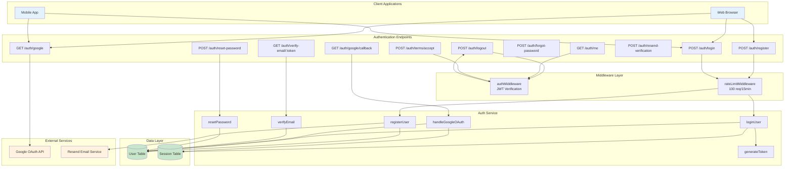
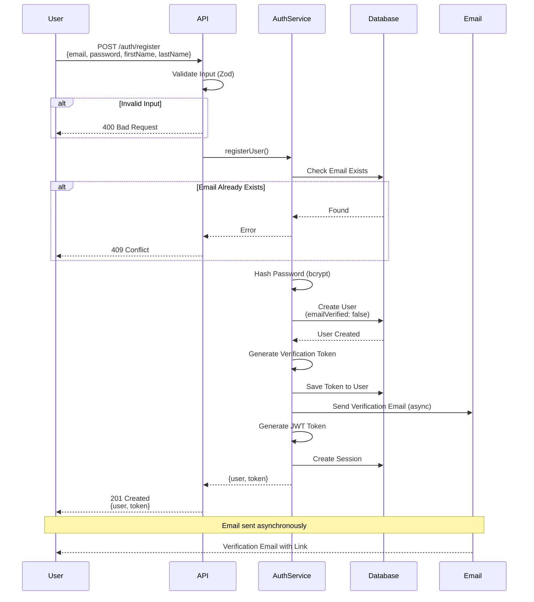
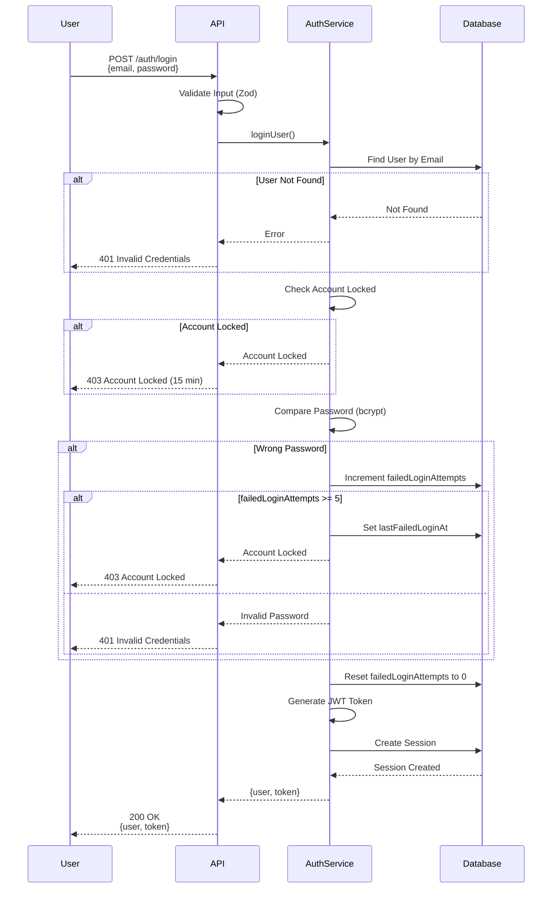
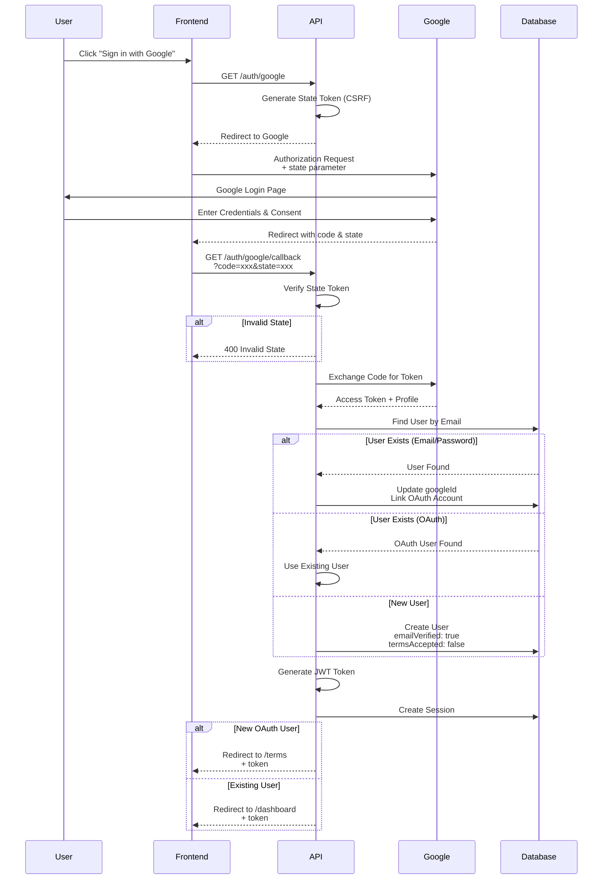
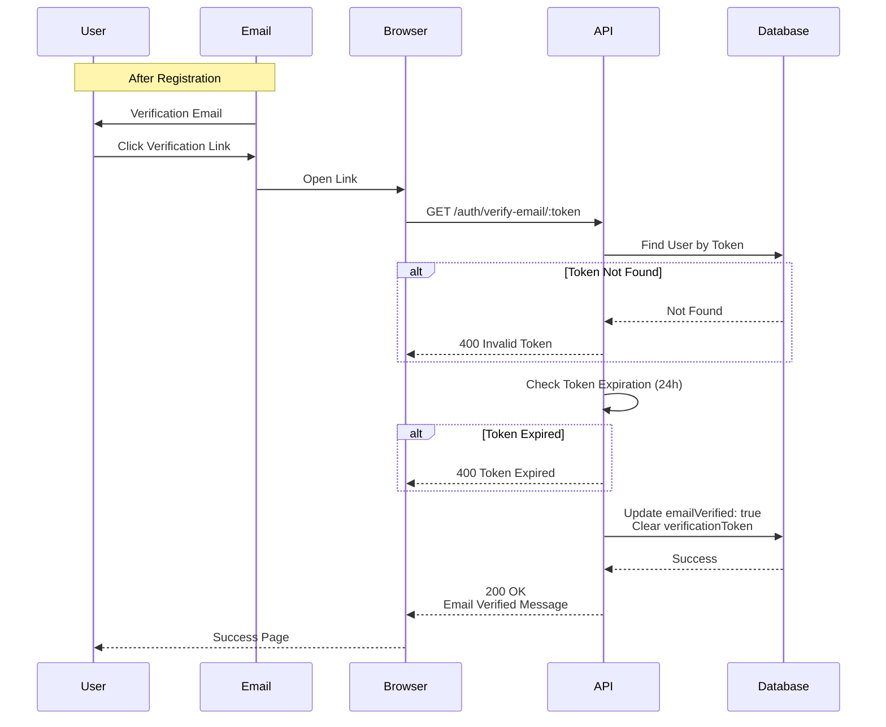
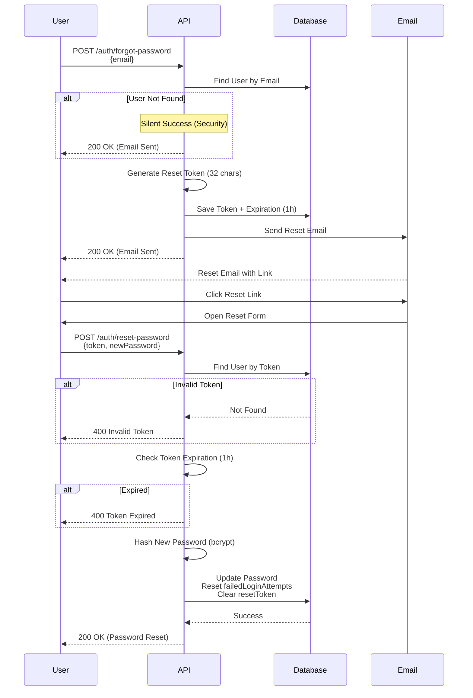
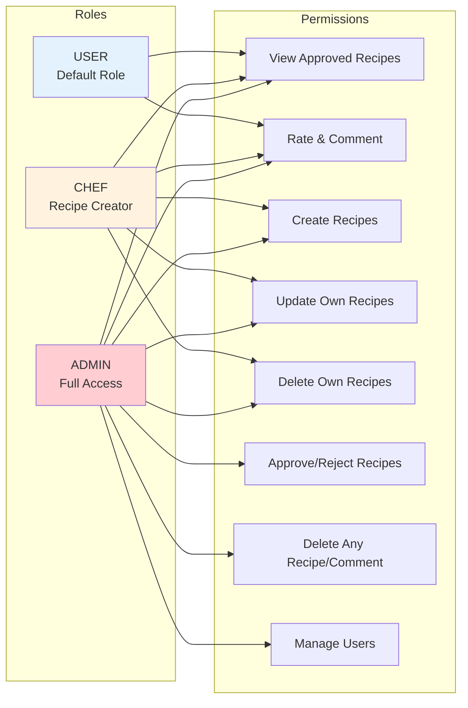

# Authentication System - Technical Documentation

**Feature**: User Authentication & Authorization  
**Version**: 1.0  
**Status**: ✅ Complete  
**Last Updated**: October 31, 2025

---

## 📋 Overview

The authentication system provides secure user registration, login, email verification, password reset, Google OAuth integration, and role-based access control (RBAC).

---

## 🎯 Features

- ✅ Email/Password Authentication
- ✅ Google OAuth 2.0 Integration
- ✅ Email Verification (optional)
- ✅ Password Reset Flow
- ✅ Session Management (JWT + Database)
- ✅ Role-Based Access Control (USER, CHEF, ADMIN)
- ✅ Account Security (rate limiting, failed login tracking)
- ✅ Terms of Service Acceptance (OAuth users)

---

## 🏗️ Architecture Diagram



---

## 🔐 Authentication Flows

### 1. Email/Password Registration Flow



### 2. Email/Password Login Flow



### 3. Google OAuth Flow



### 4. Email Verification Flow



### 5. Password Reset Flow



---

## 🗄️ Database Schema

### User Model

```prisma
model User {
  id                    String    @id @default(cuid())
  email                 String    @unique
  password              String?   // Nullable for OAuth users
  firstName             String
  lastName              String
  role                  UserRole  @default(USER)
  googleId              String?   @unique
  oauthProvider         String?
  emailVerified         Boolean   @default(false)
  verificationToken     String?   @unique
  verificationExpires   DateTime?
  resetPasswordToken    String?   @unique
  resetPasswordExpires  DateTime?
  failedLoginAttempts   Int       @default(0)
  lastFailedLoginAt     DateTime?
  termsAccepted         Boolean   @default(true)
  termsAcceptedAt       DateTime?
  createdAt             DateTime  @default(now())
  updatedAt             DateTime  @updatedAt

  // Relations
  sessions              Session[]
  recipes               Recipe[]
  ratings               Rating[]
  comments              Comment[]

  @@map("users")
}

enum UserRole {
  USER
  CHEF
  ADMIN
}
```

### Session Model

```prisma
model Session {
  id        String   @id @default(cuid())
  userId    String
  token     String   @unique
  expiresAt DateTime
  createdAt DateTime @default(now())

  user User @relation(fields: [userId], references: [id], onDelete: Cascade)

  @@map("sessions")
}
```

---

## 🔒 Security Features

### 1. Password Security
- **Hashing Algorithm**: bcrypt with configurable rounds (default: 10)
- **Password Requirements**: 
  - Minimum 6 characters
  - Validated via Zod schema
  - Never stored in plain text

### 2. JWT Token Security
- **Algorithm**: HS256
- **Expiration**: 24 hours (configurable)
- **Secret**: Minimum 32 characters
- **Payload**: `{userId, email, role}`
- **Storage**: Database sessions table

### 3. Account Protection
- **Failed Login Limit**: 5 attempts
- **Lockout Duration**: 15 minutes
- **Auto-Reset**: On successful login or password reset
- **Rate Limiting**: 100 requests per 15 minutes per IP

### 4. Token Security
- **Verification Token**: 32 random characters, 24h expiration
- **Reset Token**: 32 random characters, 1h expiration
- **OAuth State Token**: CSRF protection

### 5. Email Security
- **Domain Validation**: Email format validation
- **Unique Constraint**: Database-level unique email
- **Case Insensitivity**: Lowercase conversion

---

## 🎯 Role-Based Access Control (RBAC)



---

## 📡 API Endpoints

### Registration
```http
POST /api/v1/auth/register
Content-Type: application/json

{
  "email": "user@example.com",
  "password": "password123",
  "firstName": "John",
  "lastName": "Doe"
}

Response 201:
{
  "status": "success",
  "data": {
    "user": {
      "id": "xxx",
      "email": "user@example.com",
      "firstName": "John",
      "lastName": "Doe",
      "role": "USER",
      "emailVerified": false,
      "isOAuthUser": false,
      "termsAccepted": true
    },
    "token": "eyJhbGc..."
  }
}
```

### Login
```http
POST /api/v1/auth/login
Content-Type: application/json

{
  "email": "user@example.com",
  "password": "password123"
}

Response 200:
{
  "status": "success",
  "data": {
    "user": {...},
    "token": "eyJhbGc..."
  }
}
```

### Google OAuth
```http
GET /api/v1/auth/google
→ Redirects to Google OAuth consent page

GET /api/v1/auth/google/callback?code=xxx&state=xxx
→ Redirects to frontend with token
```

### Email Verification
```http
GET /api/v1/auth/verify-email/:token

Response 200:
{
  "status": "success",
  "message": "Email verified successfully"
}
```

### Password Reset Request
```http
POST /api/v1/auth/forgot-password
Content-Type: application/json

{
  "email": "user@example.com"
}

Response 200:
{
  "status": "success",
  "message": "Password reset email sent"
}
```

### Password Reset Confirm
```http
POST /api/v1/auth/reset-password
Content-Type: application/json

{
  "token": "reset-token-here",
  "newPassword": "newpassword123"
}

Response 200:
{
  "status": "success",
  "message": "Password reset successfully"
}
```

---

## ⚙️ Configuration

### Environment Variables

```env
# JWT Configuration
JWT_SECRET=your-super-secret-key-min-32-characters
JWT_EXPIRES_IN=24h

# Password Hashing
BCRYPT_ROUNDS=10

# Google OAuth
GOOGLE_CLIENT_ID=xxx.apps.googleusercontent.com
GOOGLE_CLIENT_SECRET=GOCSPX-xxx
GOOGLE_REDIRECT_URI=https://your-app.com/api/v1/auth/google/callback

# Email Service (Resend)
RESEND_API_KEY=re_xxx
EMAIL_FROM=noreply@yourdomain.com

# Application URLs
FRONTEND_URL=https://your-frontend.com
BACKEND_URL=https://your-backend.com
```

---

## 🧪 Testing Examples

### cURL Commands

```bash
# Register
curl -X POST http://localhost:3000/api/v1/auth/register \
  -H "Content-Type: application/json" \
  -d '{"email":"test@example.com","password":"test123","firstName":"Test","lastName":"User"}'

# Login
curl -X POST http://localhost:3000/api/v1/auth/login \
  -H "Content-Type: application/json" \
  -d '{"email":"test@example.com","password":"test123"}'

# Get Current User
curl -X GET http://localhost:3000/api/v1/auth/me \
  -H "Authorization: Bearer YOUR_JWT_TOKEN"

# Logout
curl -X POST http://localhost:3000/api/v1/auth/logout \
  -H "Authorization: Bearer YOUR_JWT_TOKEN"
```

---

## 📊 Implementation Status

| Feature | Status | Notes |
|---------|--------|-------|
| Email Registration | ✅ Complete | With email verification |
| Email Login | ✅ Complete | With account locking |
| Google OAuth | ✅ Complete | Account linking supported |
| Email Verification | ✅ Complete | 24h token expiration |
| Password Reset | ✅ Complete | 1h token expiration |
| Session Management | ✅ Complete | JWT + Database |
| RBAC | ✅ Complete | 3 roles implemented |
| Account Security | ✅ Complete | Rate limit + failed attempts |
| Terms of Service | ✅ Complete | OAuth users only |

---

**Last Updated**: October 31, 2025  
**Version**: 1.0  
**Status**: ✅ Production Ready
