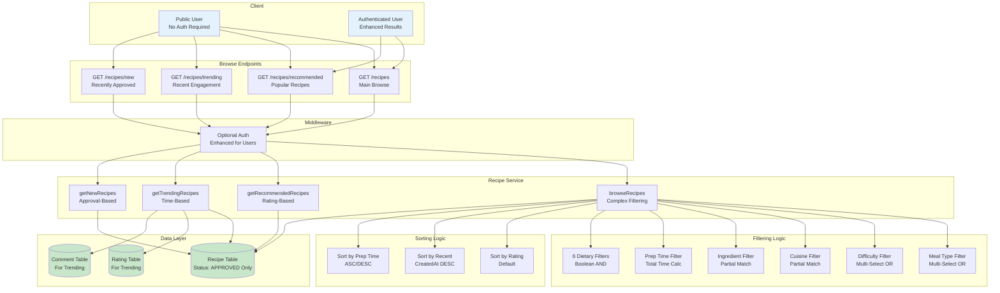
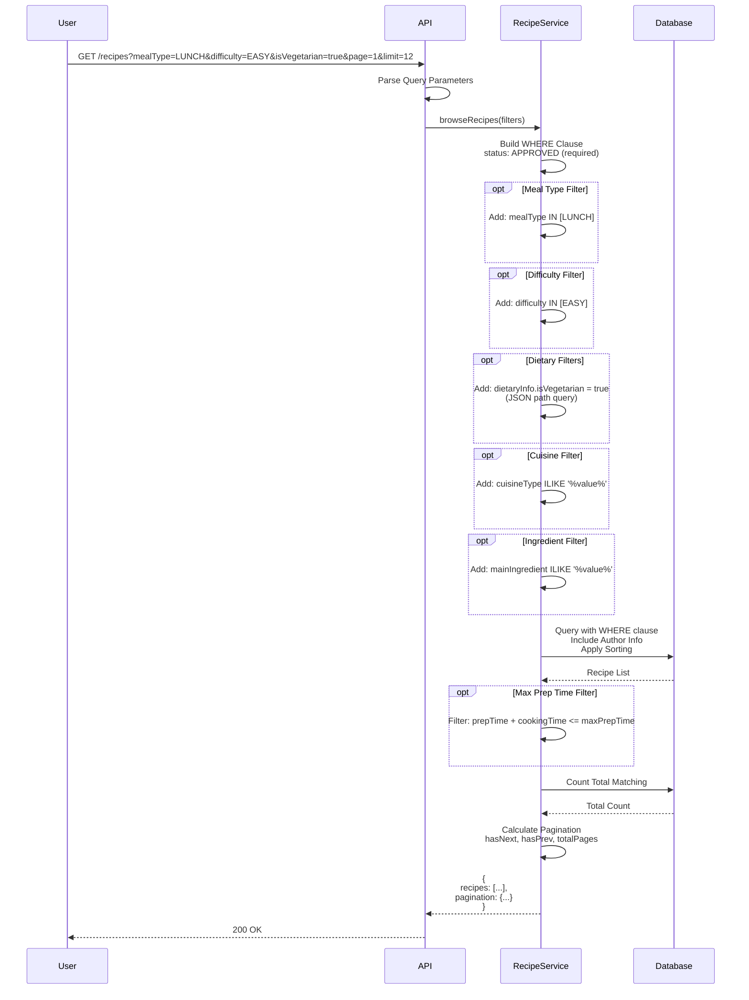
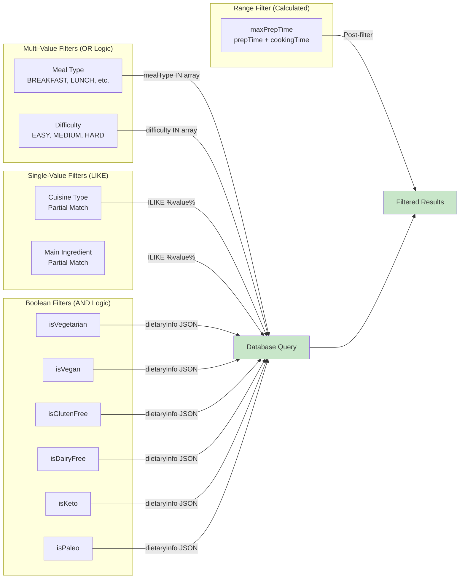
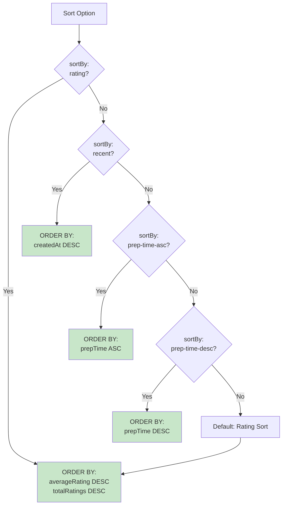
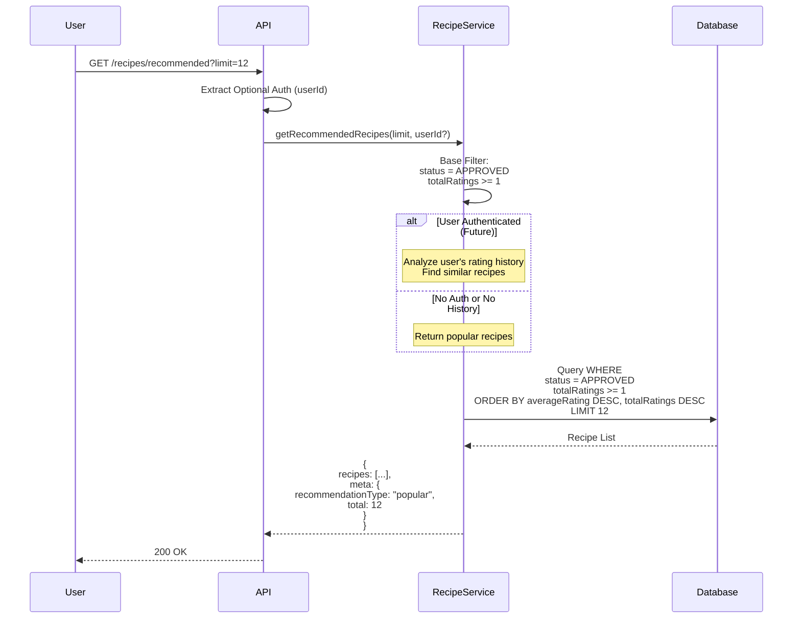
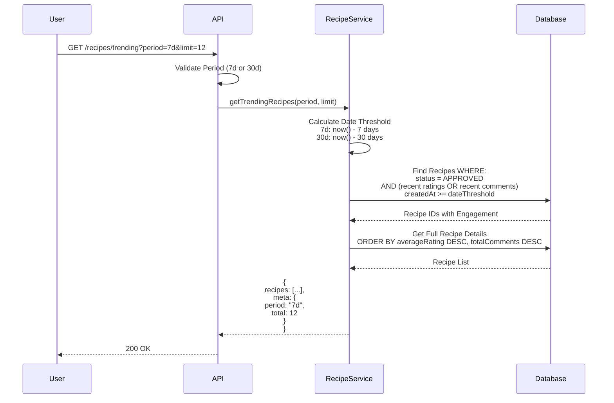
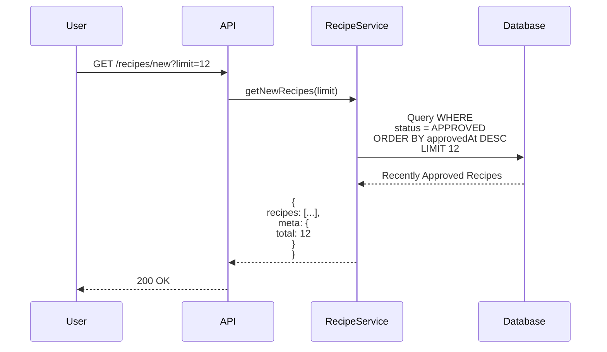

# Browse & Discovery System - Technical Documentation

**Feature**: Recipe Browse, Search, Recommendations  
**Version**: 1.0  
**Status**: ✅ Complete  
**Last Updated**: October 31, 2025

---

## 📋 Overview

The Browse & Discovery System provides advanced recipe filtering, sorting, and personalized recommendations to help users find recipes that match their preferences and dietary needs.

---

## 🎯 Features

- ✅ Advanced Browse with 10+ Filters
- ✅ Multi-Criteria Filtering (meal type, difficulty, dietary, etc.)
- ✅ Multiple Sort Options (rating, recent, prep time)
- ✅ Pagination with hasNext/hasPrev flags
- ✅ Recommended Recipes (popular-based)
- ✅ Trending Recipes (time-based engagement)
- ✅ New Recipes (recently approved)
- ✅ Public Access (no authentication required)

---

## 🏗️ Architecture Diagram



---

## 🔍 Browse Recipes Flow



---

## 🎯 Filtering System

### Filter Logic Diagram

```mermaid
graph TB
    START[Browse Request]
    BASE[Base Filter:<br/>status = APPROVED]
    
    MEAL_CHECK{Meal Type<br/>Filter?}
    DIFF_CHECK{Difficulty<br/>Filter?}
    CUISINE_CHECK{Cuisine<br/>Filter?}
    INGREDIENT_CHECK{Ingredient<br/>Filter?}
    DIETARY_CHECK{Dietary<br/>Filters?}
    PREPTIME_CHECK{Max Prep<br/>Time?}

    MEAL_APPLY[Apply OR Logic<br/>mealType IN array]
    DIFF_APPLY[Apply OR Logic<br/>difficulty IN array]
    CUISINE_APPLY[Apply LIKE<br/>Case-insensitive]
    INGREDIENT_APPLY[Apply LIKE<br/>Case-insensitive]
    DIETARY_APPLY[Apply AND Logic<br/>All must match]
    PREPTIME_APPLY[Post-Query Filter<br/>prepTime + cookingTime <= max]

    QUERY[Execute Query]
    RESULTS[Return Results]

    START --> BASE
    BASE --> MEAL_CHECK
    MEAL_CHECK -->|Yes| MEAL_APPLY
    MEAL_CHECK -->|No| DIFF_CHECK
    MEAL_APPLY --> DIFF_CHECK
    
    DIFF_CHECK -->|Yes| DIFF_APPLY
    DIFF_CHECK -->|No| CUISINE_CHECK
    DIFF_APPLY --> CUISINE_CHECK
    
    CUISINE_CHECK -->|Yes| CUISINE_APPLY
    CUISINE_CHECK -->|No| INGREDIENT_CHECK
    CUISINE_APPLY --> INGREDIENT_CHECK
    
    INGREDIENT_CHECK -->|Yes| INGREDIENT_APPLY
    INGREDIENT_CHECK -->|No| DIETARY_CHECK
    INGREDIENT_APPLY --> DIETARY_CHECK
    
    DIETARY_CHECK -->|Yes| DIETARY_APPLY
    DIETARY_CHECK -->|No| QUERY
    DIETARY_APPLY --> QUERY
    
    QUERY --> PREPTIME_CHECK
    PREPTIME_CHECK -->|Yes| PREPTIME_APPLY
    PREPTIME_CHECK -->|No| RESULTS
    PREPTIME_APPLY --> RESULTS

    style BASE fill:#fff3e0
    style QUERY fill:#c8e6c9
    style RESULTS fill:#c8e6c9
```



### Filter Types & Logic



---

## 📊 Sorting System



---

## ⭐ Recommended Recipes Flow



---

## 🔥 Trending Recipes Flow



---

## 🆕 New Recipes Flow



---

## 📄 Pagination System

```mermaid
graph TB
    REQUEST[Browse Request<br/>page=2, limit=12]
    CALC[Calculate Offset<br/>skip = (page - 1) * limit<br/>skip = 12]
    
    QUERY[Database Query<br/>SKIP 12, TAKE 12]
    COUNT[Count Total<br/>Without Pagination]
    
    TOTAL_PAGES[Calculate Total Pages<br/>Math.ceil(total / limit)]
    HAS_NEXT[hasNext = page < totalPages]
    HAS_PREV[hasPrev = page > 1]
    
    RESPONSE[Return:<br/>recipes + pagination metadata]

    REQUEST --> CALC
    CALC --> QUERY
    CALC --> COUNT
    QUERY --> TOTAL_PAGES
    COUNT --> TOTAL_PAGES
    TOTAL_PAGES --> HAS_NEXT
    TOTAL_PAGES --> HAS_PREV
    HAS_NEXT --> RESPONSE
    HAS_PREV --> RESPONSE

    style QUERY fill:#c8e6c9
    style RESPONSE fill:#c8e6c9
```

---

## 🗄️ Query Examples

### Basic Browse
```sql
SELECT * FROM recipes
WHERE status = 'APPROVED'
ORDER BY averageRating DESC, totalRatings DESC
LIMIT 12 OFFSET 0;
```

### Vegetarian Lunch Recipes
```sql
SELECT * FROM recipes
WHERE status = 'APPROVED'
  AND 'LUNCH' = ANY(mealType)
  AND dietaryInfo->>'isVegetarian' = 'true'
ORDER BY averageRating DESC
LIMIT 12;
```

### Quick & Easy Recipes
```sql
SELECT * FROM recipes
WHERE status = 'APPROVED'
  AND difficulty = 'EASY'
  AND (prepTime + cookingTime) <= 30
ORDER BY prepTime ASC
LIMIT 12;
```

### Mediterranean Keto Recipes
```sql
SELECT * FROM recipes
WHERE status = 'APPROVED'
  AND cuisineType ILIKE '%mediterranean%'
  AND dietaryInfo->>'isKeto' = 'true'
ORDER BY averageRating DESC
LIMIT 12;
```

### Trending Recipes (7 days)
```sql
SELECT DISTINCT r.* FROM recipes r
LEFT JOIN ratings rat ON rat.recipeId = r.id
LEFT JOIN comments c ON c.recipeId = r.id
WHERE r.status = 'APPROVED'
  AND (rat.createdAt >= NOW() - INTERVAL '7 days'
    OR c.createdAt >= NOW() - INTERVAL '7 days')
ORDER BY r.averageRating DESC, r.totalComments DESC
LIMIT 12;
```

---

## 📡 API Endpoints Summary

| Endpoint | Method | Auth | Description |
|----------|--------|------|-------------|
| `/recipes` | GET | ❌ Optional | Main browse with all filters |
| `/recipes/recommended` | GET | ❌ Optional | Popular recipes (personalized if auth) |
| `/recipes/trending` | GET | ❌ Optional | Recipes with recent engagement |
| `/recipes/new` | GET | ❌ Optional | Recently approved recipes |

---

## 🎛️ Filter Parameters

### Meal Type (Multi-Select, OR Logic)
```
?mealType=BREAKFAST&mealType=LUNCH
```
Returns recipes tagged with BREAKFAST **OR** LUNCH

**Values**: `BREAKFAST`, `LUNCH`, `DINNER`, `SNACK`, `DESSERT`

### Difficulty (Multi-Select, OR Logic)
```
?difficulty=EASY&difficulty=MEDIUM
```
Returns recipes with EASY **OR** MEDIUM difficulty

**Values**: `EASY`, `MEDIUM`, `HARD`

### Cuisine Type (Single, Partial Match)
```
?cuisineType=Mediterranean
```
Returns recipes with cuisine containing "mediterranean" (case-insensitive)

### Main Ingredient (Single, Partial Match)
```
?mainIngredient=Chicken
```
Returns recipes with main ingredient containing "chicken" (case-insensitive)

### Max Prep Time (Calculated Total)
```
?maxPrepTime=30
```
Returns recipes where `prepTime + cookingTime <= 30`

### Dietary Filters (Boolean, AND Logic)
```
?isVegetarian=true&isGlutenFree=true
```
Returns recipes that are **both** vegetarian **and** gluten-free

**Flags**: `isVegetarian`, `isVegan`, `isGlutenFree`, `isDairyFree`, `isKeto`, `isPaleo`

---

## 📊 Sort Options

| Sort Value | Implementation | Description |
|------------|----------------|-------------|
| `rating` | `averageRating DESC, totalRatings DESC` | Highest rated first (default) |
| `recent` | `createdAt DESC` | Most recently created |
| `prep-time-asc` | `prepTime ASC` | Shortest prep time first |
| `prep-time-desc` | `prepTime DESC` | Longest prep time first |

---

## 🔄 Combined Filter Examples

### Example 1: Quick Vegetarian Dinner
```http
GET /recipes?mealType=DINNER&isVegetarian=true&maxPrepTime=30&sortBy=rating
```
Returns: Vegetarian dinner recipes ≤30 min, sorted by rating

### Example 2: Easy Vegan Gluten-Free Breakfast
```http
GET /recipes?mealType=BREAKFAST&difficulty=EASY&isVegan=true&isGlutenFree=true
```
Returns: Easy breakfast recipes that are vegan **AND** gluten-free

### Example 3: Mediterranean Keto Recipes
```http
GET /recipes?cuisineType=Mediterranean&isKeto=true&sortBy=recent
```
Returns: Mediterranean keto recipes, newest first

### Example 4: Chicken Recipes (Quick & Easy)
```http
GET /recipes?mainIngredient=Chicken&difficulty=EASY&maxPrepTime=45&sortBy=prep-time-asc
```
Returns: Easy chicken recipes ≤45 min, shortest first

---

## 📊 Response Format

```json
{
  "status": "success",
  "data": {
    "recipes": [
      {
        "id": "xxx",
        "title": "Mediterranean Quinoa Bowl",
        "description": "...",
        "imageUrls": ["https://..."],
        "prepTime": 15,
        "cookingTime": 20,
        "difficulty": "EASY",
        "mealType": ["LUNCH", "DINNER"],
        "cuisineType": "Mediterranean",
        "mainIngredient": "Quinoa",
        "dietaryInfo": {
          "isVegetarian": true,
          "isVegan": true,
          "isGlutenFree": true,
          "isDairyFree": true,
          "isKeto": false,
          "isPaleo": false
        },
        "averageRating": 4.5,
        "totalRatings": 12,
        "totalComments": 5,
        "status": "APPROVED",
        "author": {...}
      }
    ],
    "pagination": {
      "page": 1,
      "limit": 12,
      "total": 48,
      "totalPages": 4,
      "hasNext": true,
      "hasPrev": false
    }
  }
}
```

---

## ⚡ Performance Optimizations

### Database Indexes
```prisma
@@index([status])           // Filter APPROVED only
@@index([mainIngredient])   // Fast ingredient search
@@index([authorId])         // Fast author lookup
@@index([mealType])         // Fast meal type filter
```

### Query Optimization
- Base filter (`status = APPROVED`) applied at database level
- Pagination limits result sets (default: 12, max: 50)
- Efficient WHERE clause construction
- Post-query filtering for calculated fields (prepTime + cookingTime)

### Future Enhancements
- Redis caching for trending/recommended recipes
- Materialized views for complex aggregations
- Full-text search with Elasticsearch
- Query result caching with TTL

---

## 📊 Implementation Status

| Feature | Status | Notes |
|---------|--------|-------|
| Browse with Filters | ✅ Complete | 10+ filters implemented |
| Meal Type Filter | ✅ Complete | Multi-select OR logic |
| Difficulty Filter | ✅ Complete | Multi-select OR logic |
| Cuisine Filter | ✅ Complete | Case-insensitive partial match |
| Ingredient Filter | ✅ Complete | Case-insensitive partial match |
| Prep Time Filter | ✅ Complete | Calculated total time |
| Dietary Filters | ✅ Complete | 6 boolean flags, AND logic |
| Sort Options | ✅ Complete | 4 sort options |
| Pagination | ✅ Complete | hasNext/hasPrev flags |
| Recommended | ✅ Complete | Popular-based (personalization future) |
| Trending | ✅ Complete | Time-based engagement |
| New Recipes | ✅ Complete | Recently approved |
| Public Access | ✅ Complete | No auth required |

---

**Last Updated**: October 31, 2025  
**Version**: 1.0  
**Status**: ✅ Production Ready
