# Community Engagement System - Technical Documentation

**Feature**: Recipe Ratings & Comments  
**Version**: 1.0  
**Status**: ✅ Complete  
**Last Updated**: October 31, 2025

---

## 📋 Overview

The Community Engagement System enables users to rate recipes (1-5 stars) and leave comments, fostering community interaction and providing valuable feedback to recipe creators.

---

## 🎯 Features

- ✅ Recipe Ratings (1-5 stars, one per user per recipe)
- ✅ Upsert Rating Logic (create or update)
- ✅ Automatic Rating Statistics Updates
- ✅ Rating Distribution Calculation
- ✅ Recipe Comments (CRUD operations)
- ✅ Paginated Comment Listing
- ✅ Comment Ownership Validation
- ✅ Admin Override for Deletions
- ✅ Automatic Comment Counter Updates

---

## 🏗️ Architecture Diagram

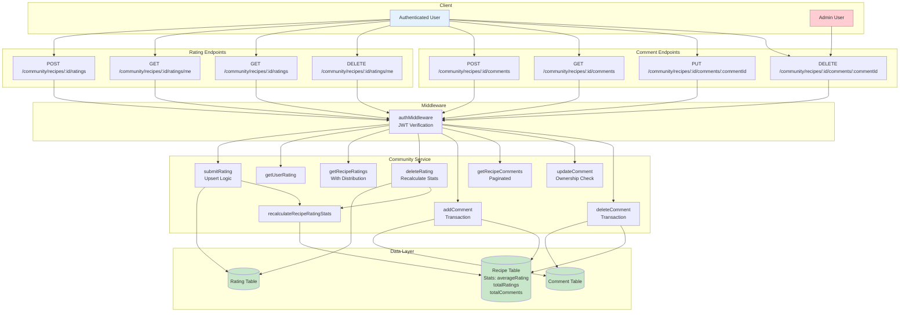

---

## ⭐ Rating System Flow

### Submit/Update Rating Flow

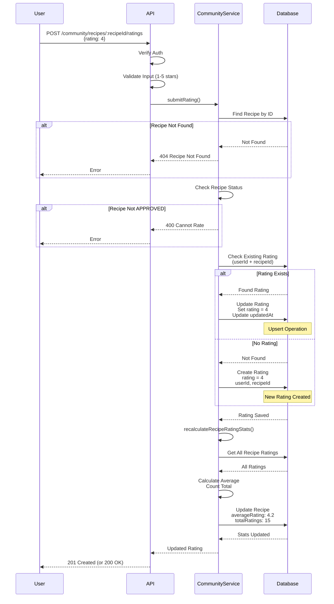

### Get Recipe Ratings with Distribution

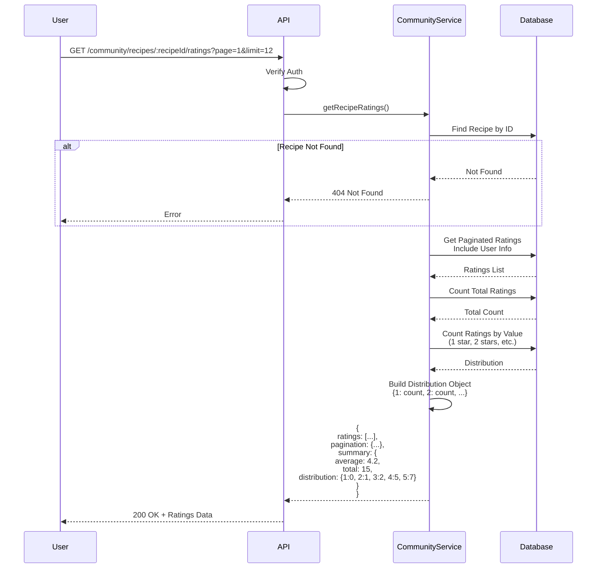

### Delete Rating Flow

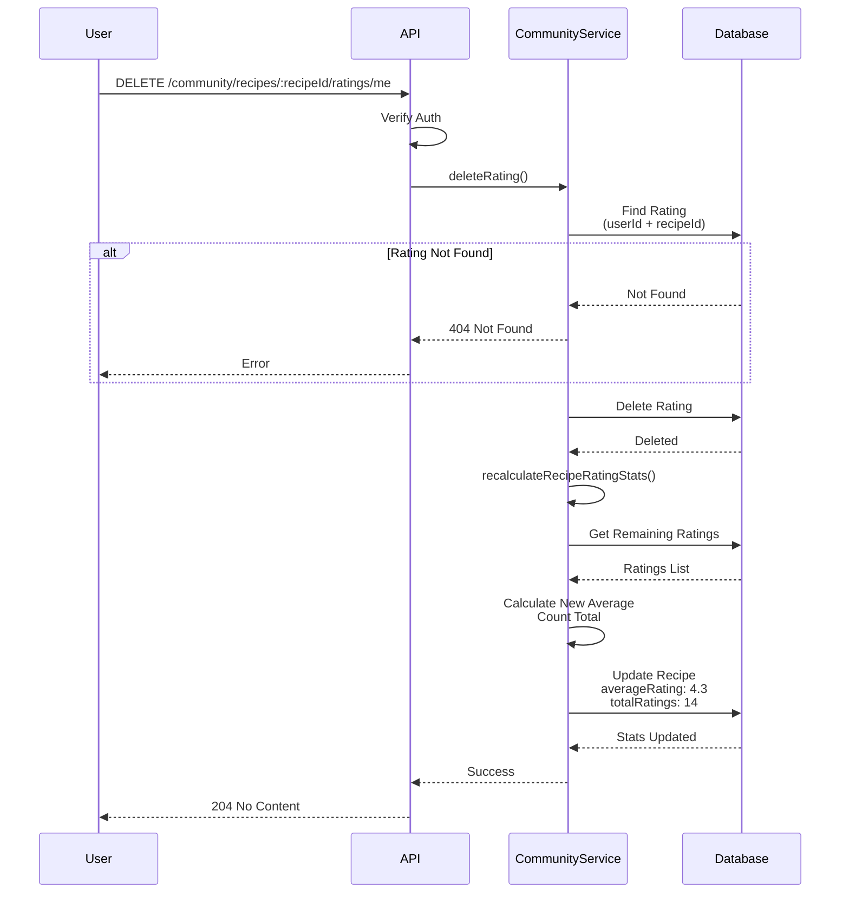

---

## 💬 Comment System Flow

### Add Comment Flow

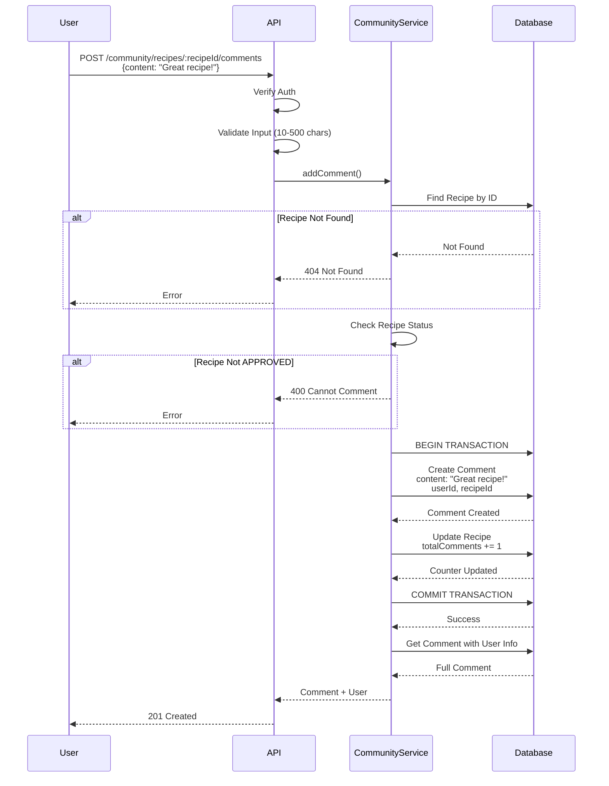

### Get Comments Flow

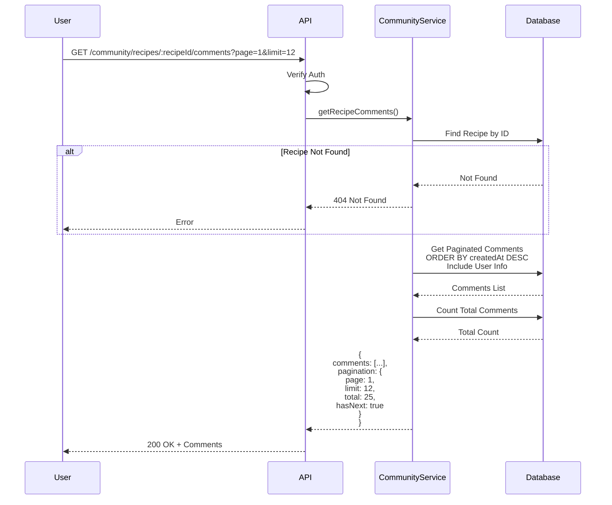

### Update Comment Flow

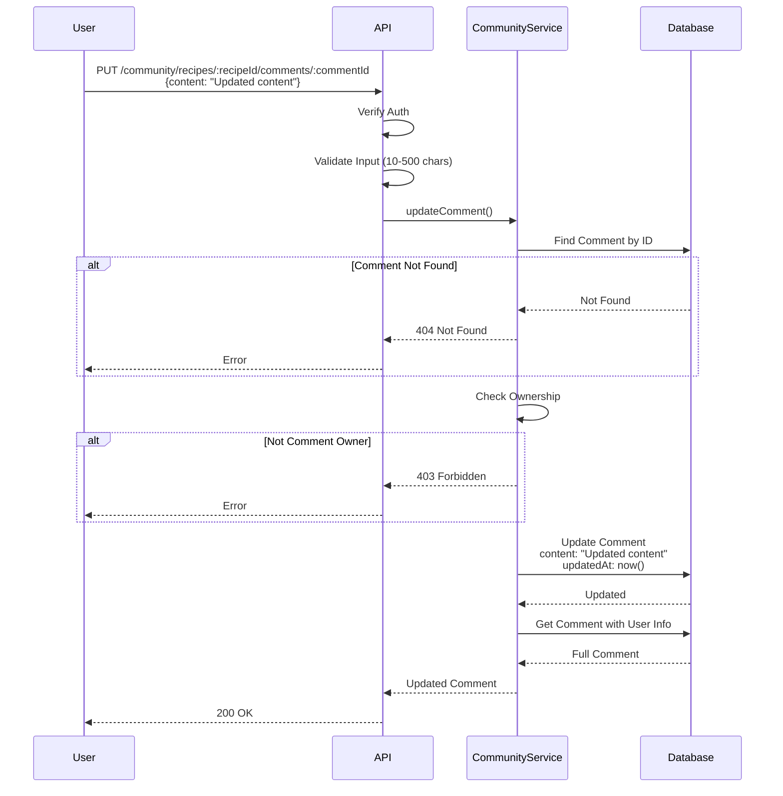

### Delete Comment Flow

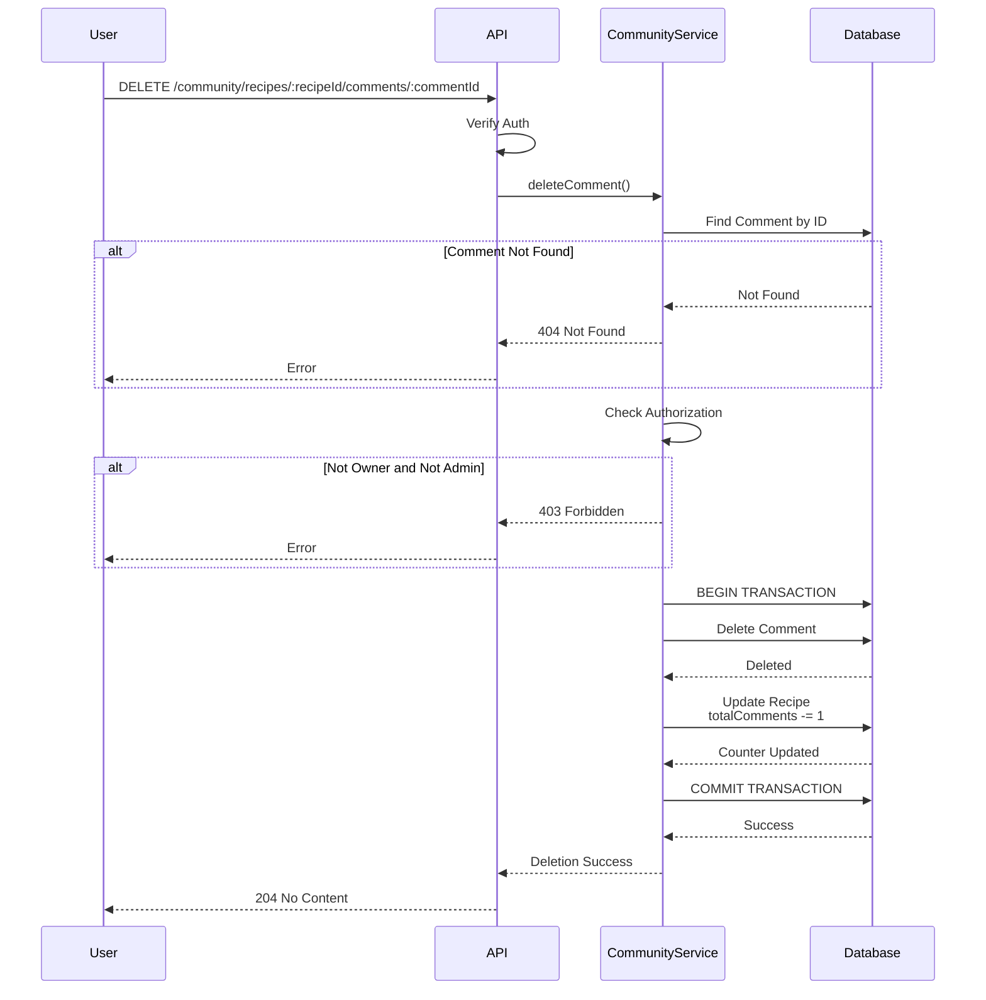

---

## 🗄️ Database Schema

### Rating Model

```prisma
model Rating {
  id        String   @id @default(cuid())
  rating    Int      @db.SmallInt  // 1-5 stars
  createdAt DateTime @default(now())
  updatedAt DateTime @updatedAt

  userId    String
  recipeId  String

  user      User   @relation(fields: [userId], references: [id], onDelete: Cascade)
  recipe    Recipe @relation(fields: [recipeId], references: [id], onDelete: Cascade)

  @@unique([userId, recipeId])  // One rating per user per recipe
  @@index([recipeId])
  @@index([userId])
  @@map("ratings")
}
```

### Comment Model

```prisma
model Comment {
  id        String   @id @default(cuid())
  content   String
  createdAt DateTime @default(now())
  updatedAt DateTime @updatedAt

  userId    String
  recipeId  String

  user      User   @relation(fields: [userId], references: [id], onDelete: Cascade)
  recipe    Recipe @relation(fields: [recipeId], references: [id], onDelete: Cascade)

  @@index([recipeId])
  @@index([userId])
  @@index([createdAt])
  @@map("comments")
}
```

### Recipe Model (Stats Fields)

```prisma
model Recipe {
  // ... other fields ...
  averageRating    Float           @default(0)
  totalRatings     Int             @default(0)
  totalComments    Int             @default(0)
  
  // Relations
  ratings          Rating[]
  comments         Comment[]
}
```

---

## 🔄 Automatic Updates

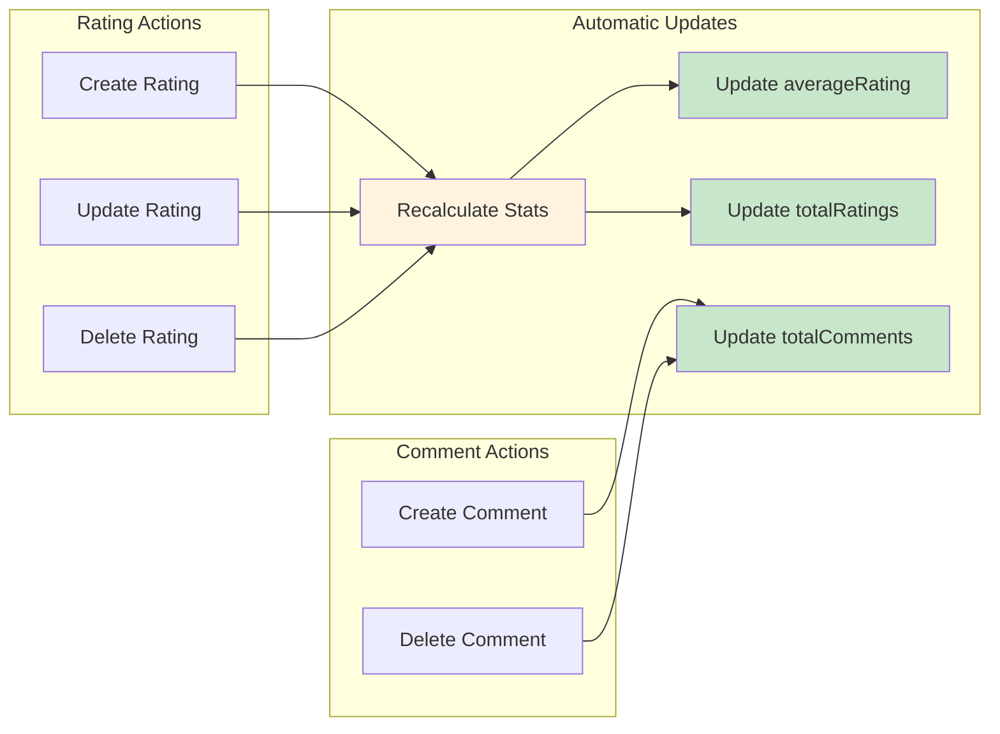

---

## 🔐 Authorization Rules

### Rating Authorization

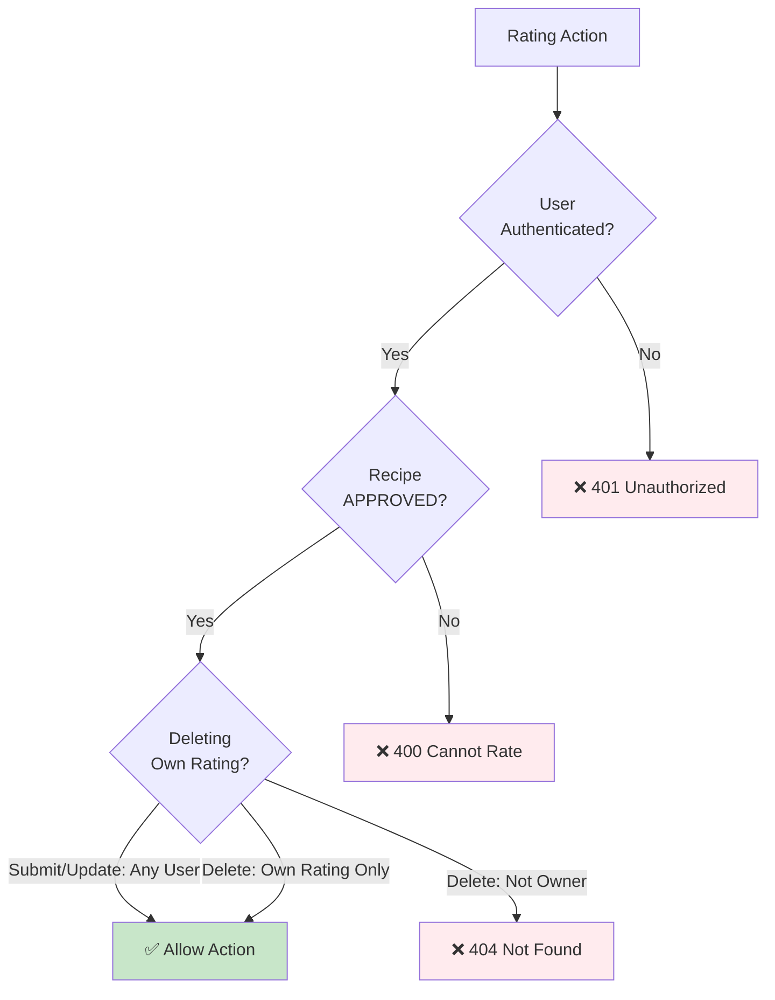

### Comment Authorization

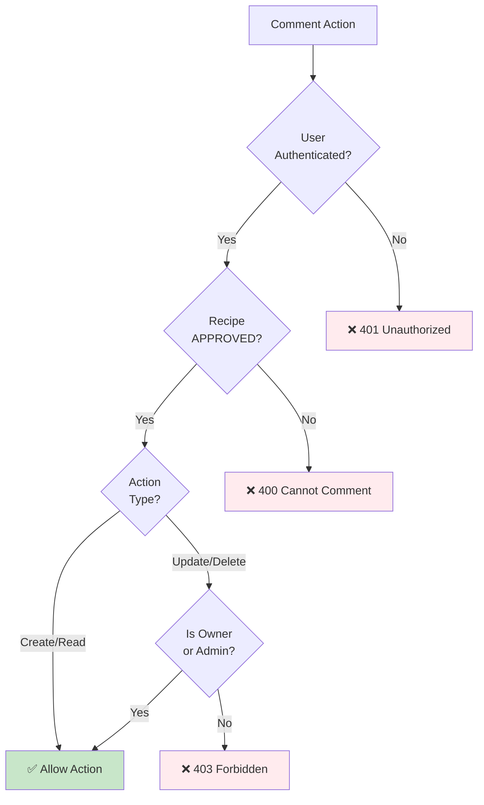

---

## 📡 API Endpoints Summary

### Rating Endpoints

| Endpoint | Method | Auth | Description |
|----------|--------|------|-------------|
| `/community/recipes/:id/ratings` | POST | ✅ Required | Submit or update rating (upsert) |
| `/community/recipes/:id/ratings/me` | GET | ✅ Required | Get user's rating for recipe |
| `/community/recipes/:id/ratings` | GET | ✅ Required | Get all ratings with distribution |
| `/community/recipes/:id/ratings/me` | DELETE | ✅ Required | Delete user's rating |

### Comment Endpoints

| Endpoint | Method | Auth | Description |
|----------|--------|------|-------------|
| `/community/recipes/:id/comments` | POST | ✅ Required | Add comment to recipe |
| `/community/recipes/:id/comments` | GET | ✅ Required | Get paginated comments |
| `/community/recipes/:id/comments/:commentId` | PUT | ✅ Required | Update own comment |
| `/community/recipes/:id/comments/:commentId` | DELETE | ✅ Required | Delete comment (owner/admin) |

---

## 📊 Implementation Status

| Feature | Status | Notes |
|---------|--------|-------|
| Submit Rating | ✅ Complete | Upsert logic (create/update) |
| Get User Rating | ✅ Complete | Single rating lookup |
| Get All Ratings | ✅ Complete | With distribution stats |
| Delete Rating | ✅ Complete | Auto-recalculate stats |
| Add Comment | ✅ Complete | Transaction with counter |
| Get Comments | ✅ Complete | Paginated, sorted by date |
| Update Comment | ✅ Complete | Ownership validation |
| Delete Comment | ✅ Complete | Admin override, transaction |
| Rating Statistics | ✅ Complete | Auto-update on changes |
| Comment Counter | ✅ Complete | Auto-update on create/delete |

---

**Last Updated**: October 31, 2025  
**Version**: 1.0  
**Status**: ✅ Production Ready
