# FitRecipes Component Diagram

> **Software Components & Code Structure** - Focus on application architecture and component relationships

**Last Updated**: November 23, 2025  
**Version**: 1.0  
**Audience**: Developers, Frontend Team, Backend Team

---

## 📦 Component Architecture Diagram

This diagram shows the **software components**, their **responsibilities**, and **relationships** at the code level.

```mermaid
graph TB
    subgraph "Frontend Layer - React 19"
        subgraph "UI Components"
            PUBLIC[Public Pages<br/>Landing, Auth, Terms]
            PROTECTED[Protected Pages<br/>Browse, Recipe Detail, My Recipes]
            ADMIN_UI[Admin Components<br/>User Mgmt, Recipe Approval, Analytics]
            CHEF_UI[Chef Components<br/>Submit Recipe, Dashboard]
        end
        
        subgraph "State Management"
            AUTH_CTX[Auth Context<br/>User + Token State]
            QUERY_CLIENT[React Query Client<br/>Server State Cache]
            SAVED_CTX[Saved Recipes Context]
        end
        
        subgraph "Service Layer"
            API_SERVICE[API Service<br/>Axios HTTP Client]
            AUTH_SVC[Auth Service<br/>Token Management]
            RECIPE_SVC[Recipe Service<br/>Recipe Operations]
            NOTIF_SVC[Notification Service<br/>FCM Integration]
        end
    end
    
    subgraph "Backend Layer - Hono.js"
        subgraph "API Routes"
            AUTH_ROUTES[Auth Routes<br/>/api/v1/auth/*]
            RECIPE_ROUTES[Recipe Routes<br/>/api/v1/recipes/*]
            ADMIN_ROUTES[Admin Routes<br/>/api/v1/admin/*]
            COMMUNITY_ROUTES[Community Routes<br/>/api/v1/community/*]
            CHEF_ROUTES[Chef Routes<br/>/api/v1/chef/*]
        end
        
        subgraph "Middleware"
            CORS_MW[CORS Middleware]
            AUTH_MW[Auth Middleware<br/>JWT Verification]
            RATE_MW[Rate Limit Middleware<br/>IP-based]
            ROLE_MW[Role Middleware<br/>adminOnly, chefOrAdmin]
            ERROR_MW[Error Handler<br/>Global Errors]
        end
        
        subgraph "Controllers"
            AUTH_CTRL[Auth Controller<br/>register, login, logout, OAuth]
            RECIPE_CTRL[Recipe Controller<br/>submit, approve, reject, delete]
            USER_CTRL[User Controller<br/>ban, unban, role change]
            COMMUNITY_CTRL[Community Controller<br/>comments, ratings, saved]
            ANALYTICS_CTRL[Analytics Controller<br/>admin, chef dashboards]
        end
        
        subgraph "Services - Business Logic"
            AUTH_SERVICE[Auth Service<br/>Password hash, JWT, OAuth]
            RECIPE_SERVICE[Recipe Service<br/>CRUD, Approval Workflow]
            USER_SERVICE[User Service<br/>Profile, Roles, Ban/Unban]
            COMMUNITY_SERVICE[Community Service<br/>Comments, Ratings, Saves]
            ANALYTICS_SERVICE[Analytics Service<br/>Charts, Metrics, Stats]
            NOTIFICATION_SERVICE[Notification Service<br/>FCM, Email]
            MODERATION_SERVICE[Moderation Service<br/>Delete Content, Audit]
        end
        
        subgraph "Utilities"
            PRISMA_UTIL[Prisma Client<br/>Database Singleton]
            SUPABASE_UTIL[Supabase Client<br/>Storage Operations]
            AUTH_UTIL[Auth Utilities<br/>hashPassword, comparePassword]
            VALIDATION[Zod Schemas<br/>Input Validation]
            HELPERS[Helper Functions<br/>API Response, Pagination]
            EMAIL_UTIL[Email Service<br/>Resend Integration]
        end
    end
    
    subgraph "Data Access Layer"
        PRISMA[Prisma ORM<br/>Type-safe Queries]
        
        subgraph "Database Models"
            USER_MODEL[User Model<br/>Roles, OAuth, Sessions]
            RECIPE_MODEL[Recipe Model<br/>Status, Ingredients, Images]
            COMMENT_MODEL[Comment Model]
            RATING_MODEL[Rating Model]
            NOTIFICATION_MODEL[Notification Model]
            SAVED_MODEL[SavedRecipe Model]
            VIEW_MODEL[RecipeView Model]
            AUDIT_MODEL[AuditLog Model]
            SESSION_MODEL[Session Model]
            FCM_MODEL[FCMToken Model]
        end
    end
    
    subgraph "External Services"
        GOOGLE_OAUTH[Google OAuth API<br/>@hono/oauth-providers]
        RESEND_API[Resend Email API<br/>Transactional Emails]
        FCM_API[Firebase Cloud Messaging<br/>Push Notifications]
        SHARP_LIB[Sharp Library<br/>Image Processing]
    end
    
    %% Frontend Component Connections
    PUBLIC --> AUTH_CTX
    PROTECTED --> QUERY_CLIENT
    ADMIN_UI --> AUTH_CTX
    CHEF_UI --> AUTH_CTX
    
    AUTH_CTX --> AUTH_SVC
    QUERY_CLIENT --> API_SERVICE
    SAVED_CTX --> RECIPE_SVC
    
    AUTH_SVC --> API_SERVICE
    RECIPE_SVC --> API_SERVICE
    NOTIF_SVC --> API_SERVICE
    
    %% API Service to Backend Routes
    API_SERVICE --> AUTH_ROUTES
    API_SERVICE --> RECIPE_ROUTES
    API_SERVICE --> ADMIN_ROUTES
    API_SERVICE --> COMMUNITY_ROUTES
    API_SERVICE --> CHEF_ROUTES
    
    %% Middleware Chain
    AUTH_ROUTES --> CORS_MW
    RECIPE_ROUTES --> CORS_MW
    ADMIN_ROUTES --> CORS_MW
    COMMUNITY_ROUTES --> CORS_MW
    CHEF_ROUTES --> CORS_MW
    
    CORS_MW --> RATE_MW
    RATE_MW --> AUTH_MW
    AUTH_MW --> ROLE_MW
    ROLE_MW --> ERROR_MW
    
    %% Controllers
    ERROR_MW --> AUTH_CTRL
    ERROR_MW --> RECIPE_CTRL
    ERROR_MW --> USER_CTRL
    ERROR_MW --> COMMUNITY_CTRL
    ERROR_MW --> ANALYTICS_CTRL
    
    %% Controllers to Services
    AUTH_CTRL --> AUTH_SERVICE
    RECIPE_CTRL --> RECIPE_SERVICE
    USER_CTRL --> USER_SERVICE
    COMMUNITY_CTRL --> COMMUNITY_SERVICE
    ANALYTICS_CTRL --> ANALYTICS_SERVICE
    
    RECIPE_SERVICE --> NOTIFICATION_SERVICE
    USER_SERVICE --> MODERATION_SERVICE
    COMMUNITY_SERVICE --> NOTIFICATION_SERVICE
    
    %% Services to Utilities
    AUTH_SERVICE --> AUTH_UTIL
    AUTH_SERVICE --> EMAIL_UTIL
    AUTH_SERVICE --> PRISMA_UTIL
    
    RECIPE_SERVICE --> PRISMA_UTIL
    RECIPE_SERVICE --> SUPABASE_UTIL
    RECIPE_SERVICE --> VALIDATION
    
    USER_SERVICE --> PRISMA_UTIL
    COMMUNITY_SERVICE --> PRISMA_UTIL
    ANALYTICS_SERVICE --> PRISMA_UTIL
    NOTIFICATION_SERVICE --> EMAIL_UTIL
    MODERATION_SERVICE --> PRISMA_UTIL
    
    AUTH_CTRL --> VALIDATION
    RECIPE_CTRL --> VALIDATION
    USER_CTRL --> VALIDATION
    COMMUNITY_CTRL --> VALIDATION
    
    %% Utilities to External Services
    AUTH_SERVICE --> GOOGLE_OAUTH
    EMAIL_UTIL --> RESEND_API
    NOTIFICATION_SERVICE --> FCM_API
    SUPABASE_UTIL --> SHARP_LIB
    
    %% Data Access Layer
    PRISMA_UTIL --> PRISMA
    
    PRISMA --> USER_MODEL
    PRISMA --> RECIPE_MODEL
    PRISMA --> COMMENT_MODEL
    PRISMA --> RATING_MODEL
    PRISMA --> NOTIFICATION_MODEL
    PRISMA --> SAVED_MODEL
    PRISMA --> VIEW_MODEL
    PRISMA --> AUDIT_MODEL
    PRISMA --> SESSION_MODEL
    PRISMA --> FCM_MODEL

    classDef frontend fill:#e3f2fd,stroke:#1976d2,stroke-width:3px
    classDef state fill:#bbdefb,stroke:#0d47a1,stroke-width:2px
    classDef routes fill:#fff3e0,stroke:#ef6c00,stroke-width:3px
    classDef middleware fill:#ffe0b2,stroke:#e65100,stroke-width:2px
    classDef controllers fill:#ffecb3,stroke:#ff6f00,stroke-width:2px
    classDef services fill:#fff9c4,stroke:#f57f17,stroke-width:3px
    classDef utilities fill:#f0f4c3,stroke:#afb42b,stroke-width:2px
    classDef data fill:#f3e5f5,stroke:#7b1fa2,stroke-width:3px
    classDef external fill:#e8f5e9,stroke:#388e3c,stroke-width:3px
    
    class PUBLIC,PROTECTED,ADMIN_UI,CHEF_UI frontend
    class AUTH_CTX,QUERY_CLIENT,SAVED_CTX,API_SERVICE,AUTH_SVC,RECIPE_SVC,NOTIF_SVC state
    class AUTH_ROUTES,RECIPE_ROUTES,ADMIN_ROUTES,COMMUNITY_ROUTES,CHEF_ROUTES routes
    class CORS_MW,AUTH_MW,RATE_MW,ROLE_MW,ERROR_MW middleware
    class AUTH_CTRL,RECIPE_CTRL,USER_CTRL,COMMUNITY_CTRL,ANALYTICS_CTRL controllers
    class AUTH_SERVICE,RECIPE_SERVICE,USER_SERVICE,COMMUNITY_SERVICE,ANALYTICS_SERVICE,NOTIFICATION_SERVICE,MODERATION_SERVICE services
    class PRISMA_UTIL,SUPABASE_UTIL,AUTH_UTIL,VALIDATION,HELPERS,EMAIL_UTIL utilities
    class PRISMA,USER_MODEL,RECIPE_MODEL,COMMENT_MODEL,RATING_MODEL,NOTIFICATION_MODEL,SAVED_MODEL,VIEW_MODEL,AUDIT_MODEL,SESSION_MODEL,FCM_MODEL data
    class GOOGLE_OAUTH,RESEND_API,FCM_API,SHARP_LIB external
```



---

## 🏗️ Component Breakdown

### 1. Frontend Components (React 19)

#### **UI Components**
| Component | Files | Responsibility |
|-----------|-------|----------------|
| **Public Pages** | Landing.tsx, Auth.tsx, Terms.tsx | Unauthenticated user interface |
| **Protected Pages** | Browse.tsx, RecipeDetail.tsx, MyRecipes.tsx | Requires authentication |
| **Admin Components** | UserManagement.tsx, RecipeApproval.tsx, Analytics.tsx | ADMIN role only |
| **Chef Components** | SubmitRecipe.tsx, ChefDashboard.tsx | CHEF/ADMIN roles |

#### **State Management**
| Component | Technology | Purpose |
|-----------|-----------|---------|
| **Auth Context** | React Context API | JWT token + user profile storage |
| **React Query Client** | TanStack Query v5 | Server state caching, automatic refetch |
| **Saved Recipes Context** | React Context API | Bookmarked recipes management |

#### **Service Layer**
| Service | Responsibility |
|---------|----------------|
| **API Service** | Axios wrapper with interceptors for auth headers |
| **Auth Service** | Login, logout, token refresh, OAuth flow |
| **Recipe Service** | Recipe CRUD, search, trending |
| **Notification Service** | FCM token registration, push notifications |

---

### 2. Backend Components (Hono.js + Bun)

#### **API Routes** (`src/routes/`)
| Route File | Endpoints | Middleware |
|-----------|-----------|-----------|
| **auth.ts** | `/auth/register`, `/auth/login`, `/auth/google` | Public + authMiddleware |
| **recipe.ts** | `/recipes`, `/recipes/:id`, `/recipes/search` | authMiddleware + chefOrAdmin |
| **admin.ts** | `/admin/users/:id/ban`, `/admin/recipes/pending` | authMiddleware + adminOnly |
| **community.ts** | `/recipes/:id/comments`, `/recipes/:id/rating` | authMiddleware |
| **chef.ts** | `/chef/analytics/overall`, `/chef/analytics/rankings` | authMiddleware + chefOrAdmin |

#### **Middleware** (`src/middlewares/`)
| Middleware | File | Purpose |
|-----------|------|---------|
| **CORS** | common.ts | Cross-origin requests handling |
| **Auth Middleware** | auth.ts | JWT token verification |
| **Rate Limiter** | rateLimit.ts | 100 req/15min per IP |
| **Role Middleware** | auth.ts | adminOnly, chefOrAdmin authorization |
| **Error Handler** | common.ts | Global error catching and formatting |

#### **Controllers** (`src/controllers/`)
| Controller | Responsibility |
|-----------|----------------|
| **authController.ts** | Handle auth requests, validate input, call auth service |
| **recipeController.ts** | Handle recipe CRUD, image upload, approval workflow |
| **adminController.ts** | User management, recipe approval, analytics |
| **communityController.ts** | Comments, ratings, saved recipes |
| **analyticsController.ts** | Admin & chef dashboard data |

#### **Services** (`src/services/`)
| Service | Business Logic |
|---------|---------------|
| **authService.ts** | Password hashing, JWT generation, OAuth user creation |
| **recipeService.ts** | Recipe CRUD, status workflow (PENDING→APPROVED/REJECTED) |
| **adminService.ts** | User ban/unban, role changes, recipe approval |
| **communityService.ts** | Comment CRUD, rating calculations, saved recipes |
| **analyticsService.ts** | Dashboard metrics, charts data, statistics |
| **notificationService.ts** | FCM push notifications, email sending |
| **chefAnalyticsService.ts** | Chef-specific metrics and rankings |

#### **Utilities** (`src/utils/`)
| Utility | Functions |
|---------|----------|
| **database.ts** | Prisma client singleton |
| **supabase.ts** | uploadFile(), deleteFile(), getPublicUrl() |
| **auth.ts** | hashPassword(), comparePassword(), generateToken() |
| **validation.ts** | Zod schemas (registerSchema, recipeSchema, etc.) |
| **helpers.ts** | createApiResponse(), createPaginationParams() |
| **email.ts** | sendEmail(), sendPasswordResetEmail(), sendVerificationEmail() |

---

### 3. Data Access Layer

#### **Prisma ORM**
- **Type-safe queries** - Auto-generated TypeScript types
- **Migration system** - Version-controlled SQL migrations
- **Connection pooling** - Managed by Supabase

#### **Database Models** (`prisma/schema.prisma`)
| Model | Key Fields | Relationships |
|-------|-----------|---------------|
| **User** | email, role, googleId, termsAccepted | hasMany: Recipe, Comment, Rating, Session |
| **Recipe** | title, status, ingredients, imageUrls | belongsTo: User (author), hasMany: Comment, Rating |
| **Comment** | content, userId, recipeId | belongsTo: User, Recipe |
| **Rating** | rating (1-5), userId, recipeId | belongsTo: User, Recipe (unique constraint) |
| **Session** | token, userId, expiresAt | belongsTo: User |
| **Notification** | message, userId, isRead | belongsTo: User |
| **SavedRecipe** | userId, recipeId | belongsTo: User, Recipe |
| **RecipeView** | userId, recipeId, ipAddress | belongsTo: User, Recipe |
| **AuditLog** | action, userId, targetId, reason | Records admin actions |
| **FCMToken** | token, userId, deviceType | belongsTo: User |

---

### 4. External Service Integration

| Service | Component | Integration Point |
|---------|-----------|-------------------|
| **Google OAuth** | @hono/oauth-providers | authService.ts → Google API |
| **Resend Email** | email.ts utility | notificationService.ts → Resend API |
| **Firebase FCM** | notificationService.ts | Push notifications to devices |
| **Sharp Image Processing** | supabase.ts utility | Image resize/compress before upload |

---

## 🔄 Request Flow Example

### **Recipe Submission Flow**

```
1. Chef clicks "Submit Recipe" (React UI)
   ↓
2. SubmitRecipe.tsx component
   ↓
3. recipeService.submitRecipe() (Frontend)
   ↓
4. API_SERVICE.post('/api/v1/recipes') with JWT token
   ↓
5. NGINX Load Balancer → Hono Server
   ↓
6. Middleware Chain:
   - CORS → Rate Limit → Auth (verify JWT) → chefOrAdmin → Error Handler
   ↓
7. recipeController.submitRecipe()
   - Validate input with Zod (recipeSchema)
   ↓
8. recipeService.submitRecipe()
   - Save recipe with status=PENDING
   - Upload images to Supabase Storage (Sharp processing)
   ↓
9. Prisma Client → PostgreSQL
   ↓
10. notificationService.notifyAdmins()
    - Send FCM notification to all admins
   ↓
11. Return 201 Created with recipe data
    ↓
12. React Query caches response
    ↓
13. UI updates with success message
```

---

## 📂 File Structure Mapping

### **Backend** (`src/`)
```
src/
├── routes/
│   ├── auth.ts              → AUTH_ROUTES
│   ├── recipe.ts            → RECIPE_ROUTES
│   ├── admin.ts             → ADMIN_ROUTES
│   ├── community.ts         → COMMUNITY_ROUTES
│   └── chef.ts              → CHEF_ROUTES
├── controllers/
│   ├── authController.ts    → AUTH_CTRL
│   ├── recipeController.ts  → RECIPE_CTRL
│   ├── adminController.ts   → USER_CTRL
│   ├── communityController.ts → COMMUNITY_CTRL
│   └── analyticsController.ts → ANALYTICS_CTRL
├── services/
│   ├── authService.ts       → AUTH_SERVICE
│   ├── recipeService.ts     → RECIPE_SERVICE
│   ├── adminService.ts      → USER_SERVICE
│   ├── communityService.ts  → COMMUNITY_SERVICE
│   ├── analyticsService.ts  → ANALYTICS_SERVICE
│   ├── notificationService.ts → NOTIFICATION_SERVICE
│   └── chefAnalyticsService.ts → MODERATION_SERVICE
├── middlewares/
│   ├── auth.ts              → AUTH_MW, ROLE_MW
│   ├── rateLimit.ts         → RATE_MW
│   └── common.ts            → CORS_MW, ERROR_MW
├── utils/
│   ├── database.ts          → PRISMA_UTIL
│   ├── supabase.ts          → SUPABASE_UTIL
│   ├── auth.ts              → AUTH_UTIL
│   ├── validation.ts        → VALIDATION
│   ├── helpers.ts           → HELPERS
│   └── email.ts             → EMAIL_UTIL
└── index.ts                 → Main app entry point
```

### **Frontend** (React - Separate Repository)
```
src/
├── components/
│   ├── public/              → PUBLIC
│   ├── protected/           → PROTECTED
│   ├── admin/               → ADMIN_UI
│   └── chef/                → CHEF_UI
├── contexts/
│   ├── AuthContext.tsx      → AUTH_CTX
│   └── SavedRecipesContext.tsx → SAVED_CTX
├── services/
│   ├── api.ts               → API_SERVICE
│   ├── authService.ts       → AUTH_SVC
│   ├── recipeService.ts     → RECIPE_SVC
│   └── notificationService.ts → NOTIF_SVC
├── hooks/
│   └── useReactQuery.ts     → QUERY_CLIENT
└── App.tsx                  → Main app component
```

---

## 🎯 Key Design Patterns

### **1. Layered Architecture**
```
UI Layer (React) 
  ↓
Service Layer (API calls)
  ↓
API Routes (Hono)
  ↓
Controllers (Request handling)
  ↓
Services (Business logic)
  ↓
Data Access (Prisma)
  ↓
Database (PostgreSQL)
```

### **2. Middleware Chain Pattern**
```
Request → CORS → Rate Limit → Auth → Role Check → Error Handler → Controller
```

### **3. Repository Pattern**
- Prisma acts as repository layer
- Services use Prisma for data access
- No direct database queries in controllers

### **4. Dependency Injection**
- Services receive Prisma client via utility
- Controllers receive validated data
- Clean separation of concerns

---

## 📝 Component Responsibilities

### **Frontend Responsibilities**
- ✅ User interface rendering
- ✅ User input validation (client-side)
- ✅ State management (auth, cache)
- ✅ API requests via services
- ✅ Error display to users

### **Backend Responsibilities**
- ✅ Authentication & authorization
- ✅ Business logic enforcement
- ✅ Data validation (server-side)
- ✅ Database operations
- ✅ External service integration
- ✅ Security (rate limiting, CORS)

### **Shared Responsibilities**
- ✅ Type definitions (TypeScript)
- ✅ Error handling (both layers)
- ✅ Logging (client & server)

---

## 🔗 Inter-Component Communication

### **Frontend ↔ Backend**
- **Protocol**: HTTP/HTTPS REST API
- **Format**: JSON
- **Auth**: JWT Bearer token in headers
- **Error Handling**: Standardized error responses

### **Backend ↔ Database**
- **Protocol**: PostgreSQL wire protocol
- **ORM**: Prisma (type-safe queries)
- **Pooling**: Supabase connection pooling

### **Backend ↔ External Services**
- **Google OAuth**: HTTPS REST API
- **Resend Email**: HTTPS REST API
- **FCM**: HTTPS REST API (Firebase SDK)
- **Supabase Storage**: HTTPS REST API

---

## 📊 Component Metrics

| Layer | Component Count | LOC (approx) |
|-------|----------------|--------------|
| Frontend UI | 20+ components | ~5,000 |
| Frontend Services | 4 services | ~800 |
| Backend Routes | 5 route files | ~500 |
| Backend Controllers | 5 controllers | ~1,200 |
| Backend Services | 7 services | ~3,000 |
| Backend Utilities | 6 utility files | ~1,000 |
| Database Models | 10 models | ~400 |
| **Total** | **50+ components** | **~12,000 LOC** |

---

## 🚀 Component Testing Strategy

### **Frontend**
- **Unit Tests**: Jest/Vitest for utilities and hooks
- **Component Tests**: React Testing Library
- **E2E Tests**: Playwright for critical flows

### **Backend**
- **Unit Tests**: Vitest for services and utilities (59 tests ✅)
- **Integration Tests**: Full request flow tests
- **API Tests**: Endpoint testing with mock data

---

**Last Updated**: November 23, 2025  
**Version**: 1.0  
**Related Documents**:
- System Architecture: `docs/SYSTEM_ARCHITECTURE.md`
- API Documentation: `docs/FRONTEND_ADMIN_CHEF_DASHBOARD_GUIDE.md`
- Authentication: `docs/AUTHENTICATION_GUIDE.md`
