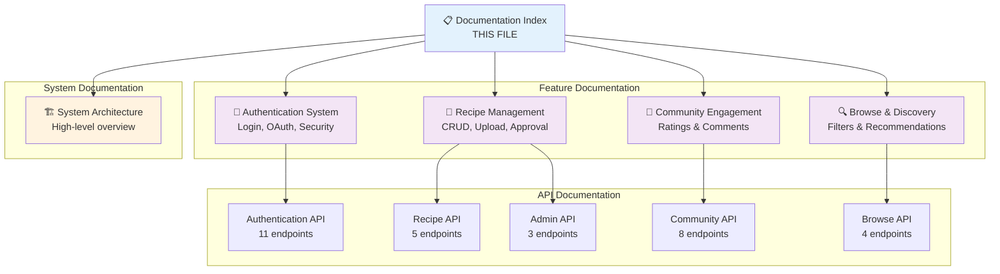

# FitRecipes Backend - Complete Documentation Index

**Version:** 1.0  
**Date:** October 31, 2025  
**Status:** ✅ Production Ready

---

## 📚 Documentation Overview

This directory contains comprehensive technical documentation for the FitRecipes Backend API, including architecture diagrams, feature specifications, and implementation details.

---

## 📖 Documentation Structure

---

## 📁 Document List

### 1. System Architecture
**File:** [`SYSTEM_ARCHITECTURE.md`](./SYSTEM_ARCHITECTURE.md)

**Contents:**
- 🏗️ High-level system architecture diagram
- 📊 Database schema overview
- 🔄 Request flow and middleware stack
- 🎯 Feature module breakdown
- 🔐 Security architecture
- 📈 Scalability strategy
- 🚀 Deployment architecture
- 📊 Technology stack

**Use When:**
- Need system-wide overview
- Understanding component interactions
- Planning infrastructure changes
- Onboarding new developers

---

### 2. Authentication System
**File:** [`AUTHENTICATION_SYSTEM_DIAGRAM.md`](./AUTHENTICATION_SYSTEM_DIAGRAM.md)

**Contents:**
- 🔐 Authentication flows (Email/Password, OAuth)
- 📧 Email verification process
- 🔑 Password reset workflow
- 🎯 Role-based access control (RBAC)
- 🛡️ Security features
- 📡 11 API endpoints
- 🗄️ User & Session models

**Covers:**
- POST `/auth/register` - User registration
- POST `/auth/login` - User login
- POST `/auth/logout` - Session termination
- GET `/auth/google` - OAuth initiation
- GET `/auth/google/callback` - OAuth callback
- POST `/auth/forgot-password` - Reset request
- POST `/auth/reset-password` - Reset confirm
- GET `/auth/verify-email/:token` - Email verification
- POST `/auth/resend-verification` - Resend email
- GET `/auth/me` - Current user profile
- POST `/auth/terms/accept` - Accept ToS

**Use When:**
- Implementing authentication
- Understanding security model
- Debugging auth issues
- Integrating OAuth

---

### 3. Recipe Management System
**File:** [`RECIPE_MANAGEMENT_SYSTEM_DIAGRAM.md`](./RECIPE_MANAGEMENT_SYSTEM_DIAGRAM.md)

**Contents:**
- 📝 Recipe submission workflow
- 📸 Multi-image upload process
- ✅ Admin approval system
- 🔍 Recipe detail authorization
- 🗑️ Recipe deletion with cleanup
- 📡 5 API endpoints (recipe CRUD)
- 📡 3 Admin endpoints (approval)
- 🗄️ Recipe model specification

**Covers:**
- POST `/recipes/upload-image` - Image upload (50/hour limit)
- POST `/recipes` - Submit recipe (Chef/Admin)
- GET `/recipes/:id` - Recipe details (auth-based visibility)
- DELETE `/recipes/:id` - Delete recipe (owner/admin)
- GET `/admin/recipes/pending` - Pending recipes list
- PUT `/admin/recipes/:id/approve` - Approve recipe
- PUT `/admin/recipes/:id/reject` - Reject recipe

**Use When:**
- Implementing recipe features
- Understanding approval workflow
- Handling image uploads
- Managing recipe lifecycle

---

### 4. Community Engagement System
**File:** [`COMMUNITY_ENGAGEMENT_SYSTEM_DIAGRAM.md`](./COMMUNITY_ENGAGEMENT_SYSTEM_DIAGRAM.md)

**Contents:**
- ⭐ Rating system (1-5 stars, upsert logic)
- 💬 Comment system (CRUD)
- 🔄 Automatic statistics updates
- 📊 Rating distribution calculation
- 📡 8 API endpoints (4 rating + 4 comment)
- 🗄️ Rating & Comment models

**Covers:**
- POST `/community/recipes/:id/ratings` - Submit/update rating
- GET `/community/recipes/:id/ratings/me` - Get user's rating
- GET `/community/recipes/:id/ratings` - Get all ratings + stats
- DELETE `/community/recipes/:id/ratings/me` - Delete rating
- POST `/community/recipes/:id/comments` - Add comment
- GET `/community/recipes/:id/comments` - Get paginated comments
- PUT `/community/recipes/:id/comments/:commentId` - Update comment
- DELETE `/community/recipes/:id/comments/:commentId` - Delete comment

**Use When:**
- Implementing ratings/comments
- Understanding upsert logic
- Managing community interactions
- Handling automatic stats

---

### 5. Browse & Discovery System
**File:** [`BROWSE_DISCOVERY_SYSTEM_DIAGRAM.md`](./BROWSE_DISCOVERY_SYSTEM_DIAGRAM.md)

**Contents:**
- 🔍 Advanced filtering (10+ filters)
- 📊 Multiple sort options
- 📄 Pagination system
- ⭐ Recommended recipes
- 🔥 Trending recipes
- 🆕 New recipes
- 📡 4 API endpoints (all public)

**Covers:**
- GET `/recipes` - Browse with filters (meal type, difficulty, dietary, cuisine, ingredient, time)
- GET `/recipes/recommended` - Popular recipes
- GET `/recipes/trending` - Recent engagement (7d/30d)
- GET `/recipes/new` - Recently approved

**Use When:**
- Implementing search/filter
- Understanding filter logic
- Building discovery features
- Optimizing queries

---

## 📊 API Endpoint Summary

**Total: 31 Endpoints** (28 implemented, 3 future)

| Module | Endpoints | Status |
|--------|-----------|--------|
| Authentication | 11 | ✅ Complete |
| Recipe Management | 5 | ✅ 4 Complete, ⏳ 1 Future |
| Admin | 3 | ✅ Complete |
| Community | 8 | ✅ Complete |
| Browse | 4 | ✅ Complete |

---

## 📞 Support

**Developer**: NinePTH  
**Repository**: [FitRecipes-Backend](https://github.com/NinePTH/FitRecipes-Backend)  
**Documentation Location**: `/docs` directory

---

**Last Updated**: October 31, 2025  
**Documentation Version**: 1.0  
**Status**: ✅ Complete & Production Ready
