# Email Verification 2FA - Sequence Diagram

This document contains Mermaid sequence diagrams for the Email Verification flow in the FitRecipes Backend API.

---

## 1. Registration with Email Verification


---

## 2. Email Verification Process


---

## 3. Resend Verification Email


---

## 4. Complete User Journey (Happy Path)


---

## 5. Error Flow - Token Expired

```mermaid
sequenceDiagram
    actor User
    participant Frontend
    participant Backend
    participant Database
    participant Email as Email Service
    
    rect rgb(255, 230, 230)
        Note over User,Email: SCENARIO: Token expired after 24 hours
        User->>Frontend: Click verification link (expired)
        Frontend->>Backend: GET /auth/verify-email/:token
        Backend->>Database: findFirst(token, expiry >= now)
        Database-->>Backend: No user found (expired)
        Backend-->>Frontend: 400 Bad Request
        Note over Backend,Frontend: "Invalid or expired token"
        Frontend-->>User: Show error + resend button
    end
    
    rect rgb(230, 255, 230)
        Note over User,Email: USER ACTION: Request new verification email
        User->>Frontend: Click "Resend verification"
        Frontend->>Backend: POST /auth/resend-verification
        Backend->>Database: Generate new token
        Database-->>Backend: Token updated
        Backend->>Email: Send new verification email
        Email-->>User: New verification email
        Backend-->>Frontend: 200 OK "Email sent"
        Frontend-->>User: "Check your email! 📧"
    end
    
    rect rgb(220, 240, 200)
        Note over User,Email: RESOLUTION: Verify with new token
        User->>Frontend: Click new verification link
        Frontend->>Backend: GET /auth/verify-email/:token
        Backend->>Database: Verify new token (valid)
        Database-->>Backend: User verified ✅
        Backend-->>Frontend: 200 OK
        Frontend-->>User: "Email verified! ✅"
    end
```



---

## Key Points

### Token Details
- **Token Generation**: 32-character random string (cryptographically secure)
- **Token Storage**: Stored in database `emailVerificationToken` field
- **Token Expiry**: 24 hours from generation
- **Token Type**: Single-use (cleared after successful verification)

### Security Features
1. **Token Expiry**: Tokens expire after 24 hours
2. **Single Use**: Tokens are cleared after verification
3. **Secure Generation**: Crypto-random token generation
4. **Database Validation**: Token must match stored value and not be expired
5. **No Personal Info in Token**: Token is random, not email-based

### User Experience
- **No Login Required**: Verification link works directly (token contains all info)
- **Multiple Attempts**: Users can resend verification email multiple times
- **Flexible Link Format**: Supports both `/verify-email/:token` and `/verify-email?token=xxx`
- **Clear Error Messages**: Specific errors for expired vs invalid tokens
- **Async Email Sending**: Registration doesn't wait for email to be sent

### Email Service
- **Development Mode**: Logs emails to console (no API key required)
- **Production Mode**: Uses Resend API when `RESEND_API_KEY` is set
- **Non-Blocking**: Email sending is async (doesn't block registration)
- **Error Handling**: Email failures logged but don't fail registration

### Database Schema
```typescript
User {
  isEmailVerified: boolean           // Verification status
  emailVerificationToken: string?    // Current token (null after verified)
  emailVerificationTokenExpiresAt: DateTime?  // Expiry timestamp
}
```

### API Endpoints
- `POST /api/v1/auth/register` - Register + auto-send verification email
- `GET /api/v1/auth/verify-email/:token` - Verify email with token
- `POST /api/v1/auth/resend-verification` - Resend verification email

---

## Testing Scenarios

### ✅ Happy Path
1. User registers → Email sent → User clicks link → Email verified

### ❌ Error Scenarios
1. **Expired Token**: User waits >24h → Token expired → Must resend
2. **Invalid Token**: User modifies link → Invalid token → Show error
3. **Already Verified**: User clicks link twice → Already verified → Show message
4. **User Not Found**: Non-existent email → User not found → Show error

### 🔄 Edge Cases
1. **Multiple Resends**: User clicks resend multiple times → Only latest token valid
2. **Concurrent Verification**: User has multiple tabs → First one succeeds, others fail gracefully
3. **Email Service Down**: Registration succeeds even if email fails to send

---

**Last Updated**: October 28, 2025  
**Status**: ✅ Fully Implemented  
**Test Coverage**: 19 integration tests for auth flow
