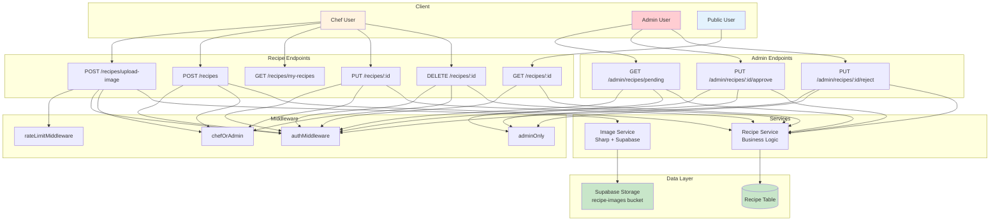
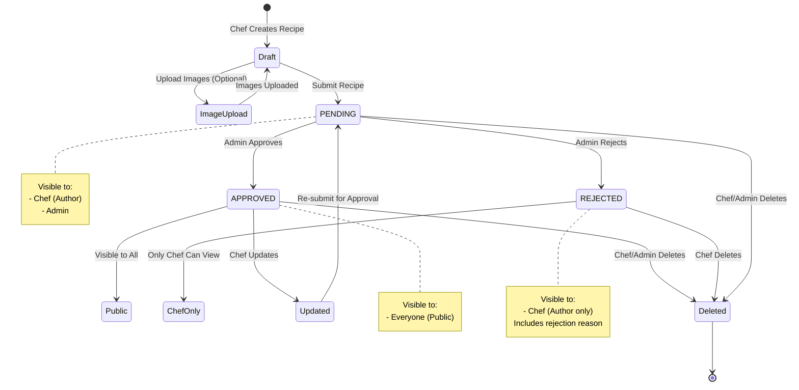
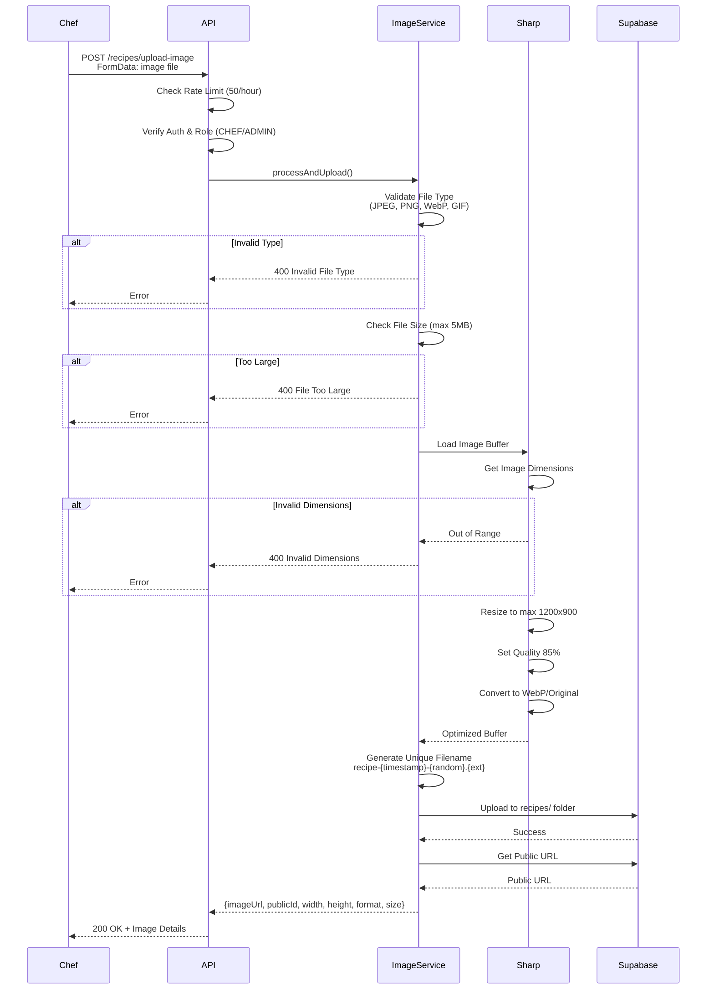
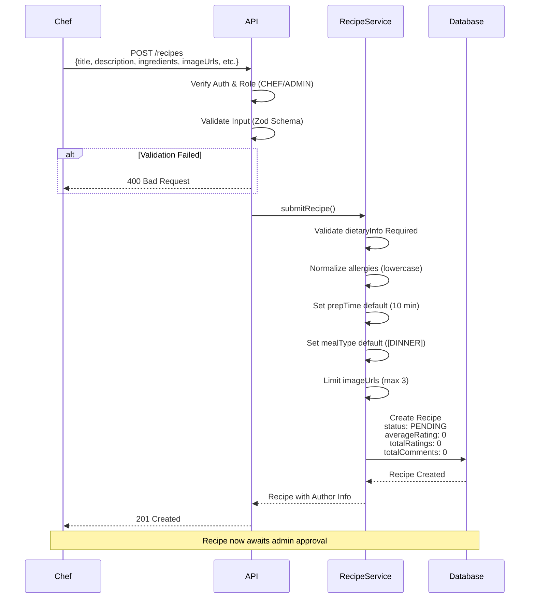
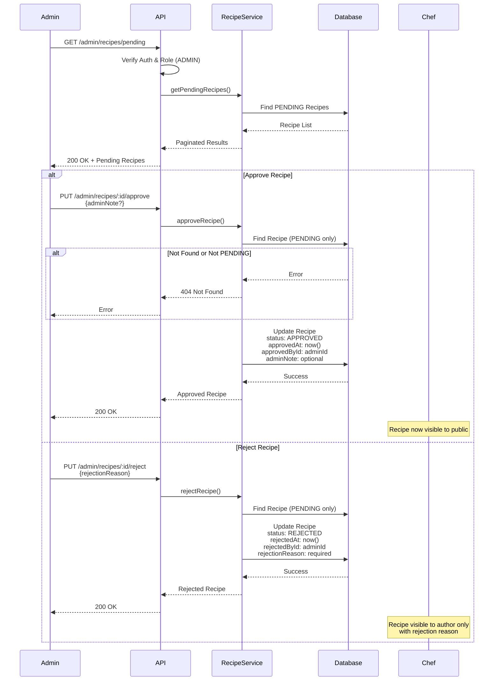
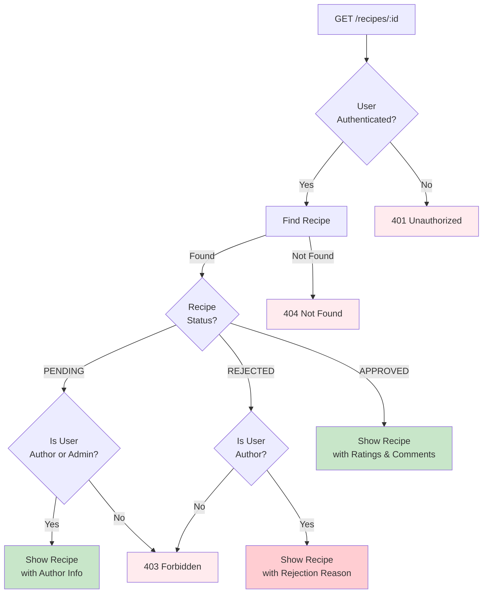
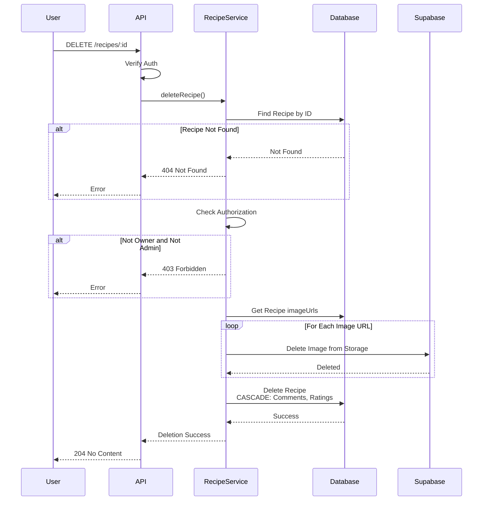
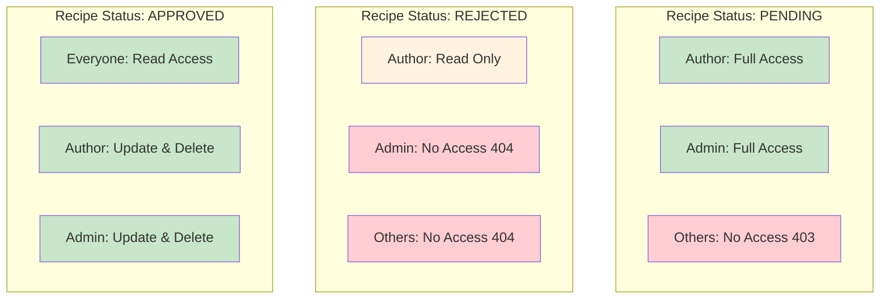

# Recipe Management System - Technical Documentation

**Feature**: Recipe CRUD, Image Upload, Admin Approval  
**Version**: 1.0  
**Status**: ✅ Complete  
**Last Updated**: October 31, 2025

---

## 📋 Overview

The Recipe Management System handles the complete lifecycle of recipes from creation to approval, including multi-image uploads, comprehensive filtering, and admin moderation workflow.

---

## 🎯 Features

- ✅ Recipe Submission (Chef/Admin only)
- ✅ Multi-Image Upload (max 3 images, optimized)
- ✅ Recipe Detail View with Authorization
- ✅ Update Own Recipes
- ✅ Delete Recipes (Owner/Admin)
- ✅ Admin Approval Workflow (PENDING → APPROVED/REJECTED)
- ✅ Recipe Status Management
- ✅ Automatic Image Cleanup on Deletion

---

## 🏗️ Architecture Diagram



---

## 🔄 Recipe Lifecycle Flow



---

## 📸 Image Upload Flow



---

## 📝 Recipe Submission Flow



---

## ✅ Admin Approval Flow



---

## 🔍 Recipe Detail View Authorization



---

## 🗑️ Recipe Deletion Flow



---

## 🗄️ Database Schema

### Recipe Model

```prisma
model Recipe {
  id               String          @id @default(cuid())
  title            String
  description      String
  mainIngredient   String
  ingredients      Json            // [{name, amount, unit}]
  instructions     String[]
  prepTime         Int             @default(10)    // minutes
  cookingTime      Int                             // minutes
  servings         Int
  difficulty       DifficultyLevel
  mealType         MealType[]      @default([DINNER])
  cuisineType      String?
  dietaryInfo      Json            // REQUIRED: {isVegetarian, isVegan, etc.}
  nutritionInfo    Json?           // Optional: {calories, protein, etc.}
  allergies        String[]        // e.g., ["nuts", "dairy", "eggs"]
  imageUrls        String[]        @default([])    // Max 3 images
  status           RecipeStatus    @default(PENDING)
  averageRating    Float           @default(0)
  totalRatings     Int             @default(0)
  totalComments    Int             @default(0)
  createdAt        DateTime        @default(now())
  updatedAt        DateTime        @updatedAt
  
  // Approval/Rejection tracking
  approvedAt       DateTime?
  approvedById     String?
  rejectedAt       DateTime?
  rejectedById     String?
  rejectionReason  String?
  adminNote        String?
  
  authorId         String

  // Relations
  author           User      @relation(fields: [authorId], references: [id])
  approvedBy       User?     @relation("ApprovedRecipes", fields: [approvedById], references: [id])
  rejectedBy       User?     @relation("RejectedRecipes", fields: [rejectedById], references: [id])
  comments         Comment[]
  ratings          Rating[]

  @@index([status])
  @@index([mainIngredient])
  @@index([authorId])
  @@index([mealType])
  @@map("recipes")
}

enum RecipeStatus {
  PENDING
  APPROVED
  REJECTED
}

enum DifficultyLevel {
  EASY
  MEDIUM
  HARD
}

enum MealType {
  BREAKFAST
  LUNCH
  DINNER
  SNACK
  DESSERT
}
```

---

## 🔒 Authorization Matrix



---

## 📡 API Endpoints

### Image Upload
```http
POST /api/v1/recipes/upload-image
Authorization: Bearer <token>
Content-Type: multipart/form-data

FormData:
  image: <file>

Response 200:
{
  "status": "success",
  "data": {
    "imageUrl": "https://xxx.supabase.co/storage/v1/object/public/recipes/recipe-xxx.webp",
    "publicId": "recipe-xxx",
    "width": 1200,
    "height": 900,
    "format": "webp",
    "size": 245678
  }
}
```

### Submit Recipe
```http
POST /api/v1/recipes
Authorization: Bearer <token>
Content-Type: application/json

{
  "title": "Mediterranean Quinoa Bowl",
  "description": "Healthy and delicious...",
  "mainIngredient": "Quinoa",
  "ingredients": [
    {"name": "Quinoa", "amount": "1", "unit": "cup"},
    {"name": "Cherry tomatoes", "amount": "1", "unit": "cup"}
  ],
  "instructions": [
    "Cook quinoa according to package directions",
    "Chop vegetables",
    "Combine all ingredients"
  ],
  "prepTime": 15,
  "cookingTime": 20,
  "servings": 2,
  "difficulty": "EASY",
  "mealType": ["LUNCH", "DINNER"],
  "cuisineType": "Mediterranean",
  "dietaryInfo": {
    "isVegetarian": true,
    "isVegan": true,
    "isGlutenFree": true,
    "isDairyFree": true,
    "isKeto": false,
    "isPaleo": false
  },
  "nutritionInfo": {
    "calories": 350,
    "protein": 12,
    "carbs": 45,
    "fat": 8
  },
  "allergies": ["nuts"],
  "imageUrls": ["https://..."]
}

Response 201:
{
  "status": "success",
  "data": {
    "id": "xxx",
    "title": "Mediterranean Quinoa Bowl",
    "status": "PENDING",
    ...
  }
}
```

### Get Recipe Details
```http
GET /api/v1/recipes/:id
Authorization: Bearer <token>

Response 200:
{
  "status": "success",
  "data": {
    "id": "xxx",
    "title": "...",
    "status": "APPROVED",
    "author": {...},
    "ratings": [...],
    ...
  }
}
```

### Delete Recipe
```http
DELETE /api/v1/recipes/:id
Authorization: Bearer <token>

Response 204: No Content
```

### Admin: Get Pending Recipes
```http
GET /api/v1/admin/recipes/pending?page=1&limit=12
Authorization: Bearer <admin-token>

Response 200:
{
  "status": "success",
  "data": {
    "recipes": [...],
    "pagination": {
      "page": 1,
      "limit": 12,
      "total": 48,
      "totalPages": 4
    }
  }
}
```

### Admin: Approve Recipe
```http
PUT /api/v1/admin/recipes/:id/approve
Authorization: Bearer <admin-token>
Content-Type: application/json

{
  "adminNote": "Great recipe! Approved." // Optional
}

Response 200:
{
  "status": "success",
  "data": {
    "id": "xxx",
    "status": "APPROVED",
    "approvedAt": "2025-10-31T10:00:00Z",
    "approvedById": "admin-id"
  }
}
```

### Admin: Reject Recipe
```http
PUT /api/v1/admin/recipes/:id/reject
Authorization: Bearer <admin-token>
Content-Type: application/json

{
  "rejectionReason": "Missing ingredient measurements" // Required
}

Response 200:
{
  "status": "success",
  "data": {
    "id": "xxx",
    "status": "REJECTED",
    "rejectedAt": "2025-10-31T10:00:00Z",
    "rejectedById": "admin-id",
    "rejectionReason": "Missing ingredient measurements"
  }
}
```

---

## 📊 Image Upload Specifications

| Constraint | Value |
|------------|-------|
| **Max File Size** | 5 MB |
| **Allowed Types** | JPEG, PNG, WebP, GIF |
| **Min Dimensions** | 400x300 pixels |
| **Max Dimensions** | 4000x3000 pixels |
| **Output Format** | WebP (or original if conversion fails) |
| **Output Quality** | 85% |
| **Max Output Width** | 1200 pixels |
| **Max Output Height** | 900 pixels |
| **Rate Limit** | 50 uploads/hour per IP |
| **Max Images per Recipe** | 3 images |

---

## 🧪 Testing Examples

```bash
# Upload Image
curl -X POST http://localhost:3000/api/v1/recipes/upload-image \
  -H "Authorization: Bearer YOUR_TOKEN" \
  -F "image=@/path/to/image.jpg"

# Submit Recipe
curl -X POST http://localhost:3000/api/v1/recipes \
  -H "Authorization: Bearer YOUR_CHEF_TOKEN" \
  -H "Content-Type: application/json" \
  -d '{
    "title": "Test Recipe",
    "description": "Test description",
    "mainIngredient": "Test",
    "ingredients": [{"name":"Test","amount":"1","unit":"cup"}],
    "instructions": ["Step 1"],
    "prepTime": 10,
    "cookingTime": 20,
    "servings": 2,
    "difficulty": "EASY",
    "dietaryInfo": {
      "isVegetarian": true,
      "isVegan": false,
      "isGlutenFree": false,
      "isDairyFree": false,
      "isKeto": false,
      "isPaleo": false
    }
  }'

# Get Recipe Details
curl -X GET http://localhost:3000/api/v1/recipes/RECIPE_ID \
  -H "Authorization: Bearer YOUR_TOKEN"

# Delete Recipe
curl -X DELETE http://localhost:3000/api/v1/recipes/RECIPE_ID \
  -H "Authorization: Bearer YOUR_TOKEN"

# Admin: Approve Recipe
curl -X PUT http://localhost:3000/api/v1/admin/recipes/RECIPE_ID/approve \
  -H "Authorization: Bearer YOUR_ADMIN_TOKEN" \
  -H "Content-Type: application/json" \
  -d '{"adminNote": "Looks great!"}'
```

---

## 📊 Implementation Status

| Feature | Status | Notes |
|---------|--------|-------|
| Image Upload | ✅ Complete | Sharp optimization, Supabase storage |
| Recipe Submission | ✅ Complete | Comprehensive validation |
| Recipe Detail View | ✅ Complete | Authorization-based visibility |
| Recipe Deletion | ✅ Complete | Automatic image cleanup |
| Admin Approval | ✅ Complete | With admin notes |
| Admin Rejection | ✅ Complete | With rejection reasons |
| My Recipes | ✅ Complete | Filter by author |
| Recipe Update | ⏳ TODO | Planned for next release |

---

**Last Updated**: October 31, 2025  
**Version**: 1.0  
**Status**: ✅ Production Ready
