# FitRecipes Backend - System Architecture

**Version:** 1.0  
**Date:** October 31, 2025  
**Status:** Production Ready

---

## 📋 Overview

FitRecipes Backend is a RESTful API built with **Hono.js**, **TypeScript**, **Prisma ORM**, and **PostgreSQL** (Supabase). The system provides recipe management, user authentication, community engagement (ratings/comments), and advanced recipe browsing capabilities.

---

## 🏗️ High-Level Architecture


---

## 📊 Database Schema Overview


---

## 🔄 Request Flow


---

## 🎯 Feature Modules

### 1. Authentication Module
- **Email/Password Authentication**
- **Google OAuth 2.0**
- **Email Verification**
- **Password Reset**
- **Session Management**
- **Role-Based Access Control (RBAC)**

### 2. Recipe Management Module
- **Recipe CRUD Operations**
- **Multi-Image Upload (max 3)**
- **Recipe Status Workflow (PENDING → APPROVED/REJECTED)**
- **Chef-Only Recipe Submission**
- **Admin Approval System**

### 3. Community Engagement Module
- **Recipe Ratings (1-5 stars)**
- **Recipe Comments**
- **Automatic Statistics Updates**
- **User Rating History**

### 4. Browse & Discovery Module
- **Advanced Filtering (10+ filters)**
- **Multi-Criteria Search**
- **Sorting Options (4 types)**
- **Recommended Recipes**
- **Trending Recipes**
- **New Recipes**

### 5. Admin Module
- **Pending Recipe Review**
- **Recipe Approval/Rejection**
- **User Management (future)**
- **Platform Analytics (future)**

---

## 🔐 Security Architecture

```mermaid
graph LR
    subgraph "Security Layers"
        INPUT[Input Validation<br/>Zod Schemas]
        AUTH[JWT Authentication<br/>24h Expiration]
        RBAC[Role-Based Access<br/>USER/CHEF/ADMIN]
        RATE[Rate Limiting<br/>100 req/15min]
        HASH[Password Hashing<br/>bcrypt]
        SANITIZE[Input Sanitization]
    end

    subgraph "Protection Against"
        SQL[SQL Injection<br/>✅ Prisma ORM]
        XSS[XSS Attacks<br/>✅ Sanitization]
        BRUTE[Brute Force<br/>✅ Rate Limit]
        CSRF[CSRF<br/>✅ OAuth State]
        LEAK[Data Leaks<br/>✅ RBAC]
    end

    INPUT --> SQL
    AUTH --> LEAK
    RBAC --> LEAK
    RATE --> BRUTE
    HASH --> BRUTE
    SANITIZE --> XSS
    AUTH --> CSRF

    style SQL fill:#c8e6c9
    style XSS fill:#c8e6c9
    style BRUTE fill:#c8e6c9
    style CSRF fill:#c8e6c9
    style LEAK fill:#c8e6c9
```



---

## 📈 Scalability Strategy

### Horizontal Scaling
- **Docker Compose**: 3 API replicas
- **Nginx Load Balancer**: Round-robin distribution
- **Stateless API**: No server-side session storage
- **Database Connection Pooling**: PgBouncer ready

### Performance Optimizations
1. **Database Indexing**: 9 indexes on frequently queried fields
2. **Pagination**: All list endpoints support pagination
3. **Query Optimization**: Prisma query optimization
4. **Image Optimization**: Sharp library for image processing
5. **Caching Strategy**: Redis ready (future implementation)

### Current Capacity
- **Concurrent Users**: 1,000+
- **Response Time**: < 2 seconds (95th percentile)
- **Throughput**: 100+ req/sec per instance

---

## 🚀 Deployment Architecture


---

## 📊 Technology Stack

| Layer | Technology | Purpose |
|-------|-----------|---------|
| **Runtime** | Bun | Fast JavaScript runtime |
| **Framework** | Hono.js | Lightweight web framework |
| **Language** | TypeScript | Type-safe development |
| **Database** | PostgreSQL (Supabase) | Relational database |
| **ORM** | Prisma | Type-safe database access |
| **Storage** | Supabase Storage | Image hosting |
| **Authentication** | JWT + OAuth 2.0 | Secure authentication |
| **Validation** | Zod | Schema validation |
| **Testing** | Vitest | Unit/integration testing |
| **Containerization** | Docker | Application packaging |
| **Orchestration** | Docker Compose | Local multi-container |
| **Load Balancer** | Nginx | Traffic distribution |
| **CI/CD** | GitHub Actions | Automated deployment |
| **Hosting** | Render | Cloud platform |

---

## 🔄 Data Flow Examples

### Recipe Submission Flow


### Rating Submission Flow


---

## 📦 Project Structure

```
FitRecipes-Backend/
├── src/
│   ├── routes/          # API endpoint definitions
│   │   ├── auth.ts      # Authentication routes
│   │   ├── recipe.ts    # Recipe management routes
│   │   ├── admin.ts     # Admin routes
│   │   └── community.ts # Rating/Comment routes
│   ├── controllers/     # Request handlers
│   ├── services/        # Business logic
│   ├── middlewares/     # Auth, CORS, Rate limit
│   ├── utils/          # Helpers, validation, DB
│   ├── types/          # TypeScript types
│   └── index.ts        # App entry point
├── prisma/
│   ├── schema.prisma   # Database schema
│   └── migrations/     # Version-controlled migrations
├── tests/              # Unit & integration tests
├── scripts/            # Utility scripts
├── docs/               # Documentation
├── .github/workflows/  # CI/CD pipelines
└── docker-compose.yml  # Multi-container setup
```

---

## 🎯 API Endpoint Summary

| Module | Endpoints | Methods | Auth Required |
|--------|-----------|---------|---------------|
| **Authentication** | 11 | GET, POST | Varies |
| **Recipe Management** | 5 | GET, POST, PUT, DELETE | Yes (Chef/Admin) |
| **Community** | 8 | GET, POST, PUT, DELETE | Yes |
| **Browse** | 4 | GET | No |
| **Admin** | 3 | GET, PUT | Yes (Admin only) |
| **Total** | **31** | - | - |

---

## 📈 Future Enhancements

### Phase 1 (Q1 2026)
- [ ] Redis caching for trending/popular recipes
- [ ] Elasticsearch integration for advanced search
- [ ] Real-time notifications (WebSocket)
- [ ] User profile customization

### Phase 2 (Q2 2026)
- [ ] Recipe collections/playlists
- [ ] Social sharing features
- [ ] Advanced analytics dashboard
- [ ] Mobile app push notifications

### Phase 3 (Q3 2026)
- [ ] AI-powered recipe recommendations
- [ ] Meal planning features
- [ ] Shopping list generation
- [ ] Nutritional analysis API

### Phase 4 (Q4 2026)
- [ ] Kubernetes migration
- [ ] Multi-region deployment
- [ ] GraphQL API layer
- [ ] Microservices architecture

---

## 📞 Support & Maintenance

**Developer**: NinePTH  
**Repository**: [FitRecipes-Backend](https://github.com/NinePTH/FitRecipes-Backend)  
**Documentation**: `/docs` directory  
**API Docs**: See individual feature guides

---

## 📝 Version History

| Version | Date | Changes |
|---------|------|---------|
| 1.0 | Oct 31, 2025 | Initial release with all core features |

---

**Last Updated**: October 31, 2025  
**Document Status**: ✅ Complete
