# FitRecipes UML Component Diagram

> **Formal UML Component Diagram** - High-level component structure with interfaces and dependencies

**Last Updated**: November 24, 2025  
**Version**: 1.0  
**Standard**: UML 2.5  
**Audience**: Software Architects, System Designers, Technical Leads

---

## 📐 UML Component Diagram

This diagram follows **UML 2.5 Component Diagram** standards, showing high-level software components, their provided/required interfaces, and dependencies.

```mermaid
graph TB
    subgraph "«system» FitRecipes Backend"
        subgraph "«component» Authentication Module"
            AUTH[«component»<br/>Authentication<br/>────────────<br/>Handles user identity,<br/>OAuth, JWT, sessions]
            AUTH_IFACE_PROVIDED["«interface»<br/>IAuthService<br/>────────────<br/>+ register()<br/>+ login()<br/>+ logout()<br/>+ verifyToken()<br/>+ handleOAuth()"]
            AUTH_IFACE_REQUIRED1["«interface»<br/>IDatabase<br/>────────────<br/>User, Session CRUD"]
            AUTH_IFACE_REQUIRED2["«interface»<br/>IEmailService<br/>────────────<br/>Send verification,<br/>password reset"]
            AUTH_IFACE_REQUIRED3["«interface»<br/>IOAuthProvider<br/>────────────<br/>Google OAuth"]
        end
        
        subgraph "«component» Recipe Management Module"
            RECIPE[«component»<br/>RecipeManagement<br/>────────────<br/>Recipe CRUD,<br/>approval workflow,<br/>image handling]
            RECIPE_IFACE_PROVIDED["«interface»<br/>IRecipeService<br/>────────────<br/>+ submitRecipe()<br/>+ approveRecipe()<br/>+ rejectRecipe()<br/>+ deleteRecipe()<br/>+ searchRecipes()"]
            RECIPE_IFACE_REQUIRED1["«interface»<br/>IDatabase<br/>────────────<br/>Recipe, View CRUD"]
            RECIPE_IFACE_REQUIRED2["«interface»<br/>IStorageService<br/>────────────<br/>Image upload/delete"]
            RECIPE_IFACE_REQUIRED3["«interface»<br/>IAuthService<br/>────────────<br/>User authorization"]
            RECIPE_IFACE_REQUIRED4["«interface»<br/>INotificationService<br/>────────────<br/>Admin notifications"]
        end
        
        subgraph "«component» Community Module"
            COMMUNITY[«component»<br/>Community<br/>────────────<br/>Comments, ratings,<br/>saved recipes,<br/>social interactions]
            COMMUNITY_IFACE_PROVIDED["«interface»<br/>ICommunityService<br/>────────────<br/>+ addComment()<br/>+ rateRecipe()<br/>+ saveRecipe()<br/>+ getComments()"]
            COMMUNITY_IFACE_REQUIRED1["«interface»<br/>IDatabase<br/>────────────<br/>Comment, Rating,<br/>SavedRecipe CRUD"]
            COMMUNITY_IFACE_REQUIRED2["«interface»<br/>IAuthService<br/>────────────<br/>User authorization"]
            COMMUNITY_IFACE_REQUIRED3["«interface»<br/>INotificationService<br/>────────────<br/>Comment notifications"]
        end
        
        subgraph "«component» Administration Module"
            ADMIN[«component»<br/>Administration<br/>────────────<br/>User management,<br/>moderation,<br/>analytics]
            ADMIN_IFACE_PROVIDED["«interface»<br/>IAdminService<br/>────────────<br/>+ banUser()<br/>+ unbanUser()<br/>+ changeUserRole()<br/>+ getAnalytics()"]
            ADMIN_IFACE_REQUIRED1["«interface»<br/>IDatabase<br/>────────────<br/>User, AuditLog CRUD"]
            ADMIN_IFACE_REQUIRED2["«interface»<br/>IAuthService<br/>────────────<br/>Admin authorization"]
            ADMIN_IFACE_REQUIRED3["«interface»<br/>INotificationService<br/>────────────<br/>User ban notifications"]
            ADMIN_IFACE_REQUIRED4["«interface»<br/>IRecipeService<br/>────────────<br/>Recipe approval"]
        end
        
        subgraph "«component» Chef Analytics Module"
            CHEF[«component»<br/>ChefAnalytics<br/>────────────<br/>Chef dashboards,<br/>metrics, rankings,<br/>statistics]
            CHEF_IFACE_PROVIDED["«interface»<br/>IChefAnalyticsService<br/>────────────<br/>+ getOverallStats()<br/>+ getRecipeMetrics()<br/>+ getRankings()"]
            CHEF_IFACE_REQUIRED1["«interface»<br/>IDatabase<br/>────────────<br/>Recipe, View,<br/>Rating queries"]
            CHEF_IFACE_REQUIRED2["«interface»<br/>IAuthService<br/>────────────<br/>Chef authorization"]
        end
        
        subgraph "«component» Notification Module"
            NOTIFICATION[«component»<br/>Notification<br/>────────────<br/>Push notifications,<br/>email delivery,<br/>FCM tokens]
            NOTIFICATION_IFACE_PROVIDED["«interface»<br/>INotificationService<br/>────────────<br/>+ sendPushNotification()<br/>+ sendEmail()<br/>+ registerFCMToken()"]
            NOTIFICATION_IFACE_REQUIRED1["«interface»<br/>IDatabase<br/>────────────<br/>Notification,<br/>FCMToken CRUD"]
            NOTIFICATION_IFACE_REQUIRED2["«interface»<br/>IFCMProvider<br/>────────────<br/>Firebase API"]
            NOTIFICATION_IFACE_REQUIRED3["«interface»<br/>IEmailProvider<br/>────────────<br/>Resend API"]
        end
        
        subgraph "«component» Data Access Module"
            DATA[«component»<br/>DataAccess<br/>────────────<br/>Database operations,<br/>ORM, migrations]
            DATA_IFACE_PROVIDED["«interface»<br/>IDatabase<br/>────────────<br/>+ findUser()<br/>+ createRecipe()<br/>+ updateComment()<br/>+ transaction()"]
        end
        
        subgraph "«component» Storage Module"
            STORAGE[«component»<br/>Storage<br/>────────────<br/>File upload/delete,<br/>image processing,<br/>CDN URLs]
            STORAGE_IFACE_PROVIDED["«interface»<br/>IStorageService<br/>────────────<br/>+ uploadImage()<br/>+ deleteImage()<br/>+ getPublicUrl()"]
            STORAGE_IFACE_REQUIRED["«interface»<br/>IImageProcessor<br/>────────────<br/>Sharp library"]
        end
    end
    
    subgraph "«external» External Services"
        GOOGLE["«component»<br/>Google OAuth API"]
        FCM["«component»<br/>Firebase FCM"]
        RESEND["«component»<br/>Resend Email API"]
        SUPABASE_DB["«component»<br/>Supabase PostgreSQL"]
        SUPABASE_STORAGE["«component»<br/>Supabase Storage"]
        SHARP["«library»<br/>Sharp Image Processing"]
    end

    %% Provided Interfaces (lollipop notation)
    AUTH -->|provides| AUTH_IFACE_PROVIDED
    RECIPE -->|provides| RECIPE_IFACE_PROVIDED
    COMMUNITY -->|provides| COMMUNITY_IFACE_PROVIDED
    ADMIN -->|provides| ADMIN_IFACE_PROVIDED
    CHEF -->|provides| CHEF_IFACE_PROVIDED
    NOTIFICATION -->|provides| NOTIFICATION_IFACE_PROVIDED
    DATA -->|provides| DATA_IFACE_PROVIDED
    STORAGE -->|provides| STORAGE_IFACE_PROVIDED
    
    %% Required Interfaces - Authentication Module
    AUTH_IFACE_REQUIRED1 -.->|requires| AUTH
    AUTH_IFACE_REQUIRED2 -.->|requires| AUTH
    AUTH_IFACE_REQUIRED3 -.->|requires| AUTH
    
    DATA_IFACE_PROVIDED -->|satisfies| AUTH_IFACE_REQUIRED1
    NOTIFICATION_IFACE_PROVIDED -->|satisfies| AUTH_IFACE_REQUIRED2
    GOOGLE -->|satisfies| AUTH_IFACE_REQUIRED3
    
    %% Required Interfaces - Recipe Module
    RECIPE_IFACE_REQUIRED1 -.->|requires| RECIPE
    RECIPE_IFACE_REQUIRED2 -.->|requires| RECIPE
    RECIPE_IFACE_REQUIRED3 -.->|requires| RECIPE
    RECIPE_IFACE_REQUIRED4 -.->|requires| RECIPE
    
    DATA_IFACE_PROVIDED -->|satisfies| RECIPE_IFACE_REQUIRED1
    STORAGE_IFACE_PROVIDED -->|satisfies| RECIPE_IFACE_REQUIRED2
    AUTH_IFACE_PROVIDED -->|satisfies| RECIPE_IFACE_REQUIRED3
    NOTIFICATION_IFACE_PROVIDED -->|satisfies| RECIPE_IFACE_REQUIRED4
    
    %% Required Interfaces - Community Module
    COMMUNITY_IFACE_REQUIRED1 -.->|requires| COMMUNITY
    COMMUNITY_IFACE_REQUIRED2 -.->|requires| COMMUNITY
    COMMUNITY_IFACE_REQUIRED3 -.->|requires| COMMUNITY
    
    DATA_IFACE_PROVIDED -->|satisfies| COMMUNITY_IFACE_REQUIRED1
    AUTH_IFACE_PROVIDED -->|satisfies| COMMUNITY_IFACE_REQUIRED2
    NOTIFICATION_IFACE_PROVIDED -->|satisfies| COMMUNITY_IFACE_REQUIRED3
    
    %% Required Interfaces - Admin Module
    ADMIN_IFACE_REQUIRED1 -.->|requires| ADMIN
    ADMIN_IFACE_REQUIRED2 -.->|requires| ADMIN
    ADMIN_IFACE_REQUIRED3 -.->|requires| ADMIN
    ADMIN_IFACE_REQUIRED4 -.->|requires| ADMIN
    
    DATA_IFACE_PROVIDED -->|satisfies| ADMIN_IFACE_REQUIRED1
    AUTH_IFACE_PROVIDED -->|satisfies| ADMIN_IFACE_REQUIRED2
    NOTIFICATION_IFACE_PROVIDED -->|satisfies| ADMIN_IFACE_REQUIRED3
    RECIPE_IFACE_PROVIDED -->|satisfies| ADMIN_IFACE_REQUIRED4
    
    %% Required Interfaces - Chef Analytics Module
    CHEF_IFACE_REQUIRED1 -.->|requires| CHEF
    CHEF_IFACE_REQUIRED2 -.->|requires| CHEF
    
    DATA_IFACE_PROVIDED -->|satisfies| CHEF_IFACE_REQUIRED1
    AUTH_IFACE_PROVIDED -->|satisfies| CHEF_IFACE_REQUIRED2
    
    %% Required Interfaces - Notification Module
    NOTIFICATION_IFACE_REQUIRED1 -.->|requires| NOTIFICATION
    NOTIFICATION_IFACE_REQUIRED2 -.->|requires| NOTIFICATION
    NOTIFICATION_IFACE_REQUIRED3 -.->|requires| NOTIFICATION
    
    DATA_IFACE_PROVIDED -->|satisfies| NOTIFICATION_IFACE_REQUIRED1
    FCM -->|satisfies| NOTIFICATION_IFACE_REQUIRED2
    RESEND -->|satisfies| NOTIFICATION_IFACE_REQUIRED3
    
    %% Required Interfaces - Storage Module
    STORAGE_IFACE_REQUIRED -.->|requires| STORAGE
    SHARP -->|satisfies| STORAGE_IFACE_REQUIRED
    
    %% Data Access to External Database
    DATA --> SUPABASE_DB
    STORAGE --> SUPABASE_STORAGE

    classDef component fill:#ffe0b2,stroke:#e65100,stroke-width:3px
    classDef interface fill:#e3f2fd,stroke:#1976d2,stroke-width:2px
    classDef external fill:#e8f5e9,stroke:#388e3c,stroke-width:2px
    
    class AUTH,RECIPE,COMMUNITY,ADMIN,CHEF,NOTIFICATION,DATA,STORAGE component
    class AUTH_IFACE_PROVIDED,RECIPE_IFACE_PROVIDED,COMMUNITY_IFACE_PROVIDED,ADMIN_IFACE_PROVIDED,CHEF_IFACE_PROVIDED,NOTIFICATION_IFACE_PROVIDED,DATA_IFACE_PROVIDED,STORAGE_IFACE_PROVIDED interface
    class AUTH_IFACE_REQUIRED1,AUTH_IFACE_REQUIRED2,AUTH_IFACE_REQUIRED3,RECIPE_IFACE_REQUIRED1,RECIPE_IFACE_REQUIRED2,RECIPE_IFACE_REQUIRED3,RECIPE_IFACE_REQUIRED4,COMMUNITY_IFACE_REQUIRED1,COMMUNITY_IFACE_REQUIRED2,COMMUNITY_IFACE_REQUIRED3,ADMIN_IFACE_REQUIRED1,ADMIN_IFACE_REQUIRED2,ADMIN_IFACE_REQUIRED3,ADMIN_IFACE_REQUIRED4,CHEF_IFACE_REQUIRED1,CHEF_IFACE_REQUIRED2,NOTIFICATION_IFACE_REQUIRED1,NOTIFICATION_IFACE_REQUIRED2,NOTIFICATION_IFACE_REQUIRED3,STORAGE_IFACE_REQUIRED interface
    class GOOGLE,FCM,RESEND,SUPABASE_DB,SUPABASE_STORAGE,SHARP external
```



---

## 🏗️ Component Definitions

### Core Business Components

| Component | Stereotype | Responsibility | Provided Interface |
|-----------|-----------|----------------|-------------------|
| **Authentication** | «component» | User identity, sessions, OAuth | IAuthService |
| **RecipeManagement** | «component» | Recipe lifecycle, approval workflow | IRecipeService |
| **Community** | «component» | Social interactions, comments, ratings | ICommunityService |
| **Administration** | «component» | User management, moderation | IAdminService |
| **ChefAnalytics** | «component» | Chef metrics, rankings, dashboards | IChefAnalyticsService |
| **Notification** | «component» | Push notifications, email delivery | INotificationService |

### Infrastructure Components

| Component | Stereotype | Responsibility | Provided Interface |
|-----------|-----------|----------------|-------------------|
| **DataAccess** | «component» | Database operations via Prisma ORM | IDatabase |
| **Storage** | «component» | File storage, image processing | IStorageService |

---

## 🔌 Interface Specifications

### IAuthService (Provided by Authentication)

**Operations:**
```typescript
interface IAuthService {
  register(email: string, password: string, ...): Promise<User>
  login(email: string, password: string): Promise<{user: User, token: string}>
  logout(token: string): Promise<void>
  verifyToken(token: string): Promise<User>
  handleOAuth(provider: string, code: string): Promise<{user: User, token: string}>
  forgotPassword(email: string): Promise<void>
  resetPassword(token: string, newPassword: string): Promise<void>
}
```

**Dependencies:**
- **Requires**: IDatabase, IEmailService, IOAuthProvider

---

### IRecipeService (Provided by RecipeManagement)

**Operations:**
```typescript
interface IRecipeService {
  submitRecipe(recipeData: RecipeInput, authorId: string): Promise<Recipe>
  approveRecipe(recipeId: string, adminId: string, note?: string): Promise<Recipe>
  rejectRecipe(recipeId: string, adminId: string, reason: string): Promise<Recipe>
  deleteRecipe(recipeId: string, userId: string, isAdmin: boolean): Promise<void>
  searchRecipes(query: SearchQuery): Promise<Recipe[]>
  getRecipeById(recipeId: string, userId?: string): Promise<Recipe>
}
```

**Dependencies:**
- **Requires**: IDatabase, IStorageService, IAuthService, INotificationService

---

### ICommunityService (Provided by Community)

**Operations:**
```typescript
interface ICommunityService {
  addComment(recipeId: string, userId: string, content: string): Promise<Comment>
  rateRecipe(recipeId: string, userId: string, rating: number): Promise<Rating>
  saveRecipe(recipeId: string, userId: string): Promise<SavedRecipe>
  getComments(recipeId: string, pagination: Pagination): Promise<Comment[]>
  getRatings(recipeId: string): Promise<RatingSummary>
}
```

**Dependencies:**
- **Requires**: IDatabase, IAuthService, INotificationService

---

### IAdminService (Provided by Administration)

**Operations:**
```typescript
interface IAdminService {
  banUser(userId: string, adminId: string, reason: string): Promise<User>
  unbanUser(userId: string, adminId: string): Promise<User>
  changeUserRole(userId: string, newRole: Role, adminId: string): Promise<User>
  getAnalytics(dateRange: DateRange): Promise<AnalyticsData>
  getPendingRecipes(pagination: Pagination): Promise<Recipe[]>
}
```

**Dependencies:**
- **Requires**: IDatabase, IAuthService, INotificationService, IRecipeService

---

### IChefAnalyticsService (Provided by ChefAnalytics)

**Operations:**
```typescript
interface IChefAnalyticsService {
  getOverallStats(chefId: string): Promise<ChefStats>
  getRecipeMetrics(chefId: string): Promise<RecipeMetrics[]>
  getRankings(chefId: string): Promise<ChefRankings>
  getEngagementTrends(chefId: string, period: string): Promise<TrendData>
}
```

**Dependencies:**
- **Requires**: IDatabase, IAuthService

---

### INotificationService (Provided by Notification)

**Operations:**
```typescript
interface INotificationService {
  sendPushNotification(userId: string, title: string, body: string, data?: object): Promise<void>
  sendEmail(to: string, subject: string, htmlContent: string): Promise<void>
  registerFCMToken(userId: string, token: string, deviceType: string): Promise<void>
  notifyRecipeApproval(recipeId: string, chefId: string): Promise<void>
  notifyRecipeRejection(recipeId: string, chefId: string, reason: string): Promise<void>
}
```

**Dependencies:**
- **Requires**: IDatabase, IFCMProvider, IEmailProvider

---

### IDatabase (Provided by DataAccess)

**Operations:**
```typescript
interface IDatabase {
  // User operations
  findUser(criteria: UserCriteria): Promise<User | null>
  createUser(userData: UserInput): Promise<User>
  updateUser(userId: string, updates: Partial<User>): Promise<User>
  
  // Recipe operations
  findRecipe(criteria: RecipeCriteria): Promise<Recipe | null>
  createRecipe(recipeData: RecipeInput): Promise<Recipe>
  updateRecipe(recipeId: string, updates: Partial<Recipe>): Promise<Recipe>
  deleteRecipe(recipeId: string): Promise<void>
  
  // Comment operations
  createComment(commentData: CommentInput): Promise<Comment>
  findComments(recipeId: string, pagination: Pagination): Promise<Comment[]>
  
  // Rating operations
  upsertRating(ratingData: RatingInput): Promise<Rating>
  
  // Transaction support
  transaction<T>(fn: (tx: Transaction) => Promise<T>): Promise<T>
}
```

**Dependencies:**
- **None** (leaf component, connects to external database)

---

### IStorageService (Provided by Storage)

**Operations:**
```typescript
interface IStorageService {
  uploadImage(file: File, folder: string, fileName: string): Promise<{url: string, publicId: string}>
  deleteImage(publicId: string): Promise<void>
  getPublicUrl(filePath: string): Promise<string>
  processImage(file: File, options: ImageOptions): Promise<Buffer>
}
```

**Dependencies:**
- **Requires**: IImageProcessor

---

## 🔗 Component Dependencies

### Dependency Matrix

|  | Auth | Recipe | Community | Admin | Chef | Notification | Data | Storage |
|--|------|--------|-----------|-------|------|--------------|------|---------|
| **Auth** | - | ❌ | ❌ | ❌ | ❌ | ✅ | ✅ | ❌ |
| **Recipe** | ✅ | - | ❌ | ❌ | ❌ | ✅ | ✅ | ✅ |
| **Community** | ✅ | ❌ | - | ❌ | ❌ | ✅ | ✅ | ❌ |
| **Admin** | ✅ | ✅ | ❌ | - | ❌ | ✅ | ✅ | ❌ |
| **Chef** | ✅ | ❌ | ❌ | ❌ | - | ❌ | ✅ | ❌ |
| **Notification** | ❌ | ❌ | ❌ | ❌ | ❌ | - | ✅ | ❌ |
| **Data** | ❌ | ❌ | ❌ | ❌ | ❌ | ❌ | - | ❌ |
| **Storage** | ❌ | ❌ | ❌ | ❌ | ❌ | ❌ | ❌ | - |

✅ = Depends on  
❌ = No dependency

---

## 📊 Component Characteristics

### Cohesion & Coupling Analysis

| Component | Cohesion | Coupling | Stability |
|-----------|----------|----------|-----------|
| **Authentication** | High (single responsibility: identity) | Medium (depends on 3 components) | Stable |
| **RecipeManagement** | High (recipe lifecycle) | High (depends on 4 components) | Moderate |
| **Community** | High (social features) | Medium (depends on 3 components) | Stable |
| **Administration** | High (admin operations) | High (depends on 4 components) | Moderate |
| **ChefAnalytics** | High (analytics only) | Low (depends on 2 components) | Stable |
| **Notification** | High (messaging only) | Low (depends on 3 external services) | Very Stable |
| **DataAccess** | High (data operations) | None (leaf component) | Very Stable |
| **Storage** | High (file operations) | Low (1 external library) | Very Stable |

---

## 🎯 Design Principles Applied

### 1. **Interface Segregation Principle (ISP)**
- Each component provides a focused interface
- Interfaces contain only methods relevant to that component's responsibility

### 2. **Dependency Inversion Principle (DIP)**
- Components depend on abstractions (interfaces), not implementations
- Example: RecipeManagement depends on `IAuthService`, not the concrete Authentication component

### 3. **Single Responsibility Principle (SRP)**
- Each component has one clear responsibility
- Authentication handles identity, RecipeManagement handles recipes, etc.

### 4. **Separation of Concerns**
- Business logic (Auth, Recipe, Community) separated from infrastructure (Data, Storage)
- External service integration isolated in specific components (Notification)

### 5. **Low Coupling, High Cohesion**
- Components minimize dependencies on other components
- Each component's internal operations are highly related

---

## 🔄 Component Interaction Patterns

### Pattern 1: Service Request Flow
```
Client Request → API Layer → Controller → Service Component → DataAccess → Database
```

### Pattern 2: Cross-Component Collaboration
```
RecipeManagement.submitRecipe()
  ↓
  calls IAuthService.verifyToken() [Authorization check]
  ↓
  calls IStorageService.uploadImage() [Store images]
  ↓
  calls IDatabase.createRecipe() [Persist data]
  ↓
  calls INotificationService.notifyAdmins() [Alert admins]
```

### Pattern 3: Event-Driven Notifications
```
User Action (e.g., recipe approval)
  ↓
RecipeManagement.approveRecipe()
  ↓
NotificationService.notifyRecipeApproval()
  ↓
  → FCM Push Notification
  → Email Notification
  → In-app Notification (stored in DB)
```

---

## 📦 Component Packaging

### Physical File Mapping

| Component | Directory | Key Files |
|-----------|-----------|-----------|
| **Authentication** | `src/services/`, `src/controllers/` | authService.ts, authController.ts |
| **RecipeManagement** | `src/services/`, `src/controllers/` | recipeService.ts, recipeController.ts |
| **Community** | `src/services/`, `src/controllers/` | communityService.ts, communityController.ts |
| **Administration** | `src/services/`, `src/controllers/` | adminService.ts, adminController.ts |
| **ChefAnalytics** | `src/services/`, `src/controllers/` | chefAnalyticsService.ts, analyticsController.ts |
| **Notification** | `src/services/` | notificationService.ts |
| **DataAccess** | `src/utils/` | database.ts (Prisma client) |
| **Storage** | `src/utils/` | supabase.ts |

---

## 🚀 Component Deployment

### Deployment Units

All components are deployed together as a **monolithic application** (currently):

```
Single Docker Container
├── All Service Components
├── DataAccess Component
└── Storage Component
```

### Future Microservices Consideration

If transitioning to microservices, suggested service boundaries:

1. **Auth Service**: Authentication component
2. **Recipe Service**: RecipeManagement + ChefAnalytics components
3. **Community Service**: Community component
4. **Admin Service**: Administration component
5. **Notification Service**: Notification component (already isolated)

Shared components (DataAccess, Storage) would become libraries or separate services.

---

## 📚 Related Documentation

- **Application Architecture**: `docs/APPLICATION_ARCHITECTURE.md` (detailed code structure)
- **System Architecture**: `docs/SYSTEM_ARCHITECTURE.md` (infrastructure & deployment)
- **API Documentation**: `docs/FRONTEND_ADMIN_CHEF_DASHBOARD_GUIDE.md`
- **Database Schema**: `prisma/schema.prisma`

---

**Last Updated**: November 24, 2025  
**Version**: 1.0  
**Standard**: UML 2.5 Component Diagram  
**Maintained By**: Software Architecture Team
